# 个人知识库项目文档

版本：v0.1  
日期：2026-07-12  
项目代号：Personal Knowledge Base

## 目录

- [1. 项目定位](#1-项目定位)
- [2. 背景与目标](#2-背景与目标)
- [3. 用户场景](#3-用户场景)
- [4. MVP 范围](#4-mvp-范围)
- [5. 总体架构](#5-总体架构)
- [6. 核心业务流程](#6-核心业务流程)
- [7. 模块设计](#7-模块设计)
- [8. 数据模型](#8-数据模型)
- [9. 状态机设计](#9-状态机设计)
- [10. API 设计草案](#10-api-设计草案)
- [11. RAG 策略](#11-rag-策略)
- [12. 文档导出设计](#12-文档导出设计)
- [13. 技术选型](#13-技术选型)
- [14. 目录结构建议](#14-目录结构建议)
- [15. 安全、合规与隐私](#15-安全合规与隐私)
- [16. 质量评估](#16-质量评估)
- [17. 里程碑规划](#17-里程碑规划)
- [18. 风险与取舍](#18-风险与取舍)
- [19. 已冻结的实施决策](#19-已冻结的实施决策)
- [20. 参考资料源](#20-参考资料源)

## 1. 项目定位

本项目是一个“主题驱动”的本地优先学习型知识库系统。

第一版聚焦一条可验证的学习闭环：用户上传 PDF、粘贴文本或导入静态网页 URL，系统完成解析、父子切片、混合检索索引和知识点草稿抽取；用户确认后，系统提供分层讲解、费曼复述、Rubric 判题、薄弱点识别和复习调度，并至少完成一次到期复习与掌握度更新。MVP 同时提供 Topic 内 Top 3 父块检索服务用于验证索引质量；资料发现、完整 RAG 问答 UI、知识星图、AI 伴侣和画像属于后续阶段，不进入 MVP 主线。

默认产品形态：通过 Docker Compose 运行在用户本机、仅监听 localhost 的私有多用户 Web 应用，由首个管理员通过邀请码开放账号。

- 本地优先边界：原始资料、业务数据、向量、学习记录和 Provider 凭据密文保存在用户本机；PDF 解析和业务流程在本机执行。
- 外部模型计算：LLM 默认调用用户配置的官网或中转站 API，Embedding 默认调用自托管远程 Ollama HTTPS 网关；两者都只在用户授权后接收当前任务所需的最小文本。
- 正式用户边界：第一版建立 `User`、登录、邀请码注册和 `user_id` 数据归属；管理员可以启停账号，但不能读取用户密码、API Key 明文或资料正文。
- 主题驱动：系统围绕主题组织资料、知识点和个人学习状态，而不是泛化搜索引擎。

一句话概括：

> 把用户自己的资料转化为可确认、可讲解、可考核、可复习并持续更新掌握度的学习资产。

### 1.1 冻结范围与术语入口

本节是 M0 之后需求拆解、接口命名和验收的权威入口。其他章节的示例不得扩大这里定义的阶段范围；术语细节由 D01–D14 补充，但不得改变下列对象的职责。

#### 阶段边界

| 范围 | 包含 | 明确不包含 |
|---|---|---|
| MVP（M1–M6） | 本地基础设施、身份边界、三类资料导入、父子切片、Topic 内 Top 3 混合检索、知识点草稿与确认、SSE 讲解、费曼复述、Rubric 判题、BKT 和一次真实到期复习 | 自动资料发现、完整 RAG 对话、Markdown 对话导出、知识星图、AI 伴侣、跨会话记忆、认知画像 |
| M7 | 资料发现、候选确认入库、完整 RAG 引用问答与导出 | 不改变正式知识点、学习事件和掌握度的事实语义 |
| M8 | 知识关系可视化、伴侣权限、跨会话记忆、画像和知识质量操作 | 情绪时序默认关闭；不提供医学判断；有副作用工具不得绕过确认 |

M0 只冻结范围、架构和契约，不实现运行时代码。`MVP` 是 M1–M6 共同交付的产品闭环，不是单独的 Linear Milestone。

#### 核心术语

| 术语 | 唯一定义 | 边界说明 |
|---|---|---|
| `Topic` | 用户组织资料、检索和复习入口的主题容器 | 不是知识点分类算法，也不是跨用户共享空间 |
| `SourceCandidate` | M7 资料发现产生、尚未经用户确认的候选 | 不进入解析、索引或学习状态；确认后才转换为 `SourceDocument` |
| `SourceDocument` | 一份逻辑资料的稳定身份 | 不等同于某次上传文件或某次解析结果 |
| `SourceRevision` | `SourceDocument` 的不可变内容版本 | 由内容 hash 标识具体版本；删除和切换遵循 D07 |
| `IngestionRun` | 对某个 `SourceRevision` 执行的一次不可变解析、切片和索引运行 | 失败重试生成新 Run；只有完整验证后才能原子发布 |
| `ParsedDocument` | Run 内生成的规范化解析产物 | 是可重建派生产物，不是业务事实源 |
| Parent / Child Chunk | 同一 Run 内的不可变父块与检索子块 | Child 用于召回，Parent 用于返回上下文；不得自动升级为知识点 |
| `KnowledgePointDraft` | 从资料抽取、等待用户确认的知识点草稿 | 未确认前不得进入讲解、判题、掌握度或复习流程 |
| `KnowledgePoint` | 用户确认的、可跨资料复用的个人知识概念 | 来源通过 `KnowledgePointSourceRef` 关联，不归属于单一资料 |
| `LearningEvent` | 不可变、可排序、可幂等处理的学习事实 | dispute 和算法变化只能追加新事实或补偿事件，不覆盖历史 |
| `MasteryState` | 从 `LearningEvent` 与固定模型版本归约出的可重建投影 | 不是事实源；展示时可计算带 `evaluated_at` 的有效掌握度 |
| 学习 Session | 学习或复习交互的持久化流程实例总称 | 具体使用 `LearningSession`、`ReviewSession` 等明确名称 |
| 登录 Session | 服务端认证会话 | 与学习 Session 分离，Cookie 和生命周期遵循 D06 |
| `Operation` | 面向客户端的异步操作资源 | 用于查询进度和结果，不等同于 Worker 内部任务或 Outbox 事件 |
| Provider | 实现 LLM 或 Embedding 端口的外部计算适配器 | Provider、模型、地址、凭据和数据授权均为用户级配置；不得硬编码 |

#### 技术基线

- MySQL 是结构化业务数据与事务状态的唯一事实源；不使用 SQLite 作为运行时替代。
- Milvus 只保存可重建向量索引及业务引用，不承载不可重建业务状态。
- 原始文件和解析产物保存在本机文件卷，路径、hash、版本和状态由 MySQL 管理。
- MVP 不引入 Redis / Celery；关键异步工作使用 MySQL Outbox、任务表、租约、幂等键和有限重试。
- 远程 Ollama 原生端口不得暴露公网，只能通过带 API Key 的 HTTPS 网关访问。
- LLM 和 Embedding 的任何外部发送都受用户授权与最小必要数据原则约束。

## 2. 背景与目标

### 2.1 背景

个人学习或研究时，经常会遇到以下问题：

- 资料散落在论文站、搜索引擎、博客、官方文档、白皮书中。
- 用户需要手动筛选 PDF、下载、保存、整理。
- 资料读完后很难复用，尤其是跨文档比较、追问和总结。
- 普通 AI 对话无法稳定引用用户自己的资料，容易出现“看似合理但没有依据”的回答。
- 对话结果不容易沉淀为可编辑、可归档的文档。

本项目要解决的不是“聊天”，而是“主题资料沉淀 + 可靠引用问答 + 文档化输出”。

### 2.2 产品目标

MVP 只闭环以下主线：

1. 用户通过本地账号登录并创建主题。
2. 用户上传文本型 PDF、粘贴文本或提交静态网页 URL。
3. 系统统一生成 `SourceDocument`，保存原始资料并按内容 hash 去重。
4. Worker 解析资料，在不可变 `IngestionRun` 内生成 Parent/Child Chunk，并建立 Child 的 Dense 与 BM25/稀疏索引。
5. Topic 内检索分别召回 Dense Top 20 和 BM25 Top 20 Child，经 `retrieval-v1` RRF 融合并按 Parent 折叠，返回 3 个不同 Parent。
6. 外部 LLM 从解析结果中抽取 `KnowledgePointDraft`。
7. 用户在轻量确认工作台查看来源、编辑核心字段、通过或拒绝草稿。
8. 只有通过确认的草稿才能成为正式 `KnowledgePoint`。
9. 系统通过 SSE 进行分层讲解，用户完成费曼复述。
10. Rubric 对复述逐项判题，生成 `weakness_tags`；Medium 允许 dispute。
11. 系统创建 `ReviewTask`，用户至少完成一次到期复习。
12. BKT 根据学习证据更新 `MasteryState`，并计算下一次复习时间。
13. 所有关键状态变化写入 `LearningEvent`，能够解释掌握度为何变化。

### 2.3 非目标

MVP 阶段不做以下内容：

- 不实现主题推荐 20 份候选资料、GitHub Trending、外部论文 / 资讯搜索和智能推荐。
- 不实现完整 RAG 对话、LLM 引用回答和 Markdown 对话导出；仅实现可独立验收的 Topic 内 Top 3 父块检索服务。
- 不实现 Atlas v2、AI 伴侣、认知画像和情绪时序。
- 不绕过付费墙下载受限论文。
- 不做通用互联网爬虫或动态网页 Playwright 抓取。
- 不做多人协作、复杂角色权限和商业计费。
- 不实现知识点复杂合并、拆分、图谱关系编辑和批量自动清洗。
- 不追求大规模分布式检索，优先保证个人学习闭环稳定可用。
- 不把 LLM、Embedding、判题或向量库绑定到具体供应商，领域模块只依赖 Provider 接口。

## 3. 用户场景

### 3.1 研究型学习

用户输入主题：“Transformer 在时间序列预测中的应用”。

系统返回候选资料：论文、综述、arXiv PDF、官方教程、开源项目文档。用户选择其中 5 篇 PDF 下载并入库。随后用户可以提问：

- “这些资料里 Transformer 做时间序列预测的主要优势是什么？”
- “不同论文对长序列问题的处理方式有什么差异？”
- “请把可以复现的模型结构整理成 Markdown 笔记。”

系统回答必须带引用，引用到具体资料和页码或章节。

### 3.2 技术选型调研

用户输入主题：“本地 RAG 向量数据库选型”。

系统检索 Qdrant、Chroma、Milvus、pgvector 等资料。用户可以问：

- “个人本地知识库更适合哪个向量库？”
- “如果后续迁移到云端，需要预留哪些接口？”
- “请导出一份技术选型对比文档。”

### 3.3 长期知识沉淀

用户围绕多个主题建立知识库，例如：

- AI 工程化
- 产品设计
- 心理学阅读
- 投资研究

每个主题都有独立资料集合、对话记录和导出文档，避免不同主题之间互相污染检索上下文。

## 4. MVP 范围

### 4.1 必须实现

- Docker Compose 本地运行。
- 本地 `User`、密码登录和 `user_id` 数据归属，不实现复杂权限系统。
- 默认 Strict Local；网页抓取与外部 AI 处理采用独立授权。
- 主题创建与管理。
- 输入来源：文本型 PDF 上传、粘贴文本、静态网页 URL。
- 原始资料本地持久化、hash 去重和显式任务状态。
- 资料解析为统一 `ParsedDocument`，并在不可变 Run 内生成 Parent/Child Chunk。
- 为 Child 建立 Dense 与 BM25/稀疏索引；在用户选择的 Topic 内分别召回 Top 20，经 `retrieval-v1` RRF 融合、按 Parent 折叠并返回 Top 3 不同父块。
- 提供内部检索 API 或测试页，展示 Top 3 的 PDF、页码、父块及命中子块；不在 MVP 内调用 LLM 生成问答答案。
- 外部 LLM 抽取 `KnowledgePointDraft`；调用前必须检查用户授权并记录脱敏审计。
- 轻量知识点确认工作台：来源查看、核心字段编辑、通过、拒绝和 `review_policy` 设置。
- 确认后创建正式 `KnowledgePoint`；未确认草稿不得进入学习状态。
- SSE 分层讲解和可恢复的学习 Session。
- 费曼复述和 Rubric 逐项判题。
- `weakness_tags` 生成和 Medium dispute 重评。
- 创建 `ReviewTask`，支持 Easy / Medium / Hard 三档复习。
- 至少完成一次到期复习、BKT 掌握度更新和下一次调度。
- 关键状态变化写入不可覆盖的 `LearningEvent`。
- MySQL 保存全部结构化业务数据，Milvus 保存向量，本地卷保存原始文件和解析产物。

### 4.2 可以后置

- `data/notes/` Markdown 扫描。
- 扫描版 PDF OCR 和图表识别。
- 动态网页 Playwright 抓取。
- 主题推荐 20 份候选资料及候选选择页面。
- GitHub Trending、外部论文 / 资讯搜索和薄弱点智能推荐。
- RAG 对话、引用回答和 Markdown 对话导出。
- 知识点草稿复杂合并 / 拆分交互、图谱关系编辑和批量清洗。
- 积分、Streak、Streak Freeze 的完整激励 UI。
- Atlas v2、AI 伴侣、跨会话记忆、认知画像和情绪时序。
- 多主题联合问答、多用户权限、浏览器插件和桌面客户端。

### 4.3 核心验收标准

MVP 是否成功，不看页面和外围功能数量，而看以下闭环是否能在 Strict Local 下稳定复现：

> 登录 → 上传 / 粘贴 / URL 导入 → 解析 → AI 抽取知识点草稿 → 用户编辑确认 → SSE 分层讲解 → 费曼复述 → Rubric 判题 → 生成 `weakness_tags` → 创建复习任务 → 完成一次到期复习 → 更新 `MasteryState` → 计算下次复习时间。

验收必须包含：

- 1 个文本型 PDF、1 段粘贴文本和 1 个静态网页 URL。
- 至少 5 个用户确认后的正式知识点。
- 1 次通过、1 次失败和 1 次 dispute 重评。
- 1 次真实到期复习、掌握度更新和重新调度。
- Strict Local 下没有未经授权的外部 AI、搜索或遥测请求。

### 4.4 与新增目标的差异对照

对照当前文档，新增目标主要补齐五类能力：

| 目标分组 | 当前文档覆盖情况 | 需要补充的能力 |
| --- | --- | --- |
| 知道学什么 | 已有主题推荐 20 份候选资料、网页 URL、PDF / 文本 / Markdown 输入 | GitHub Trending 追踪、外部论文 / 资讯搜索、基于薄弱点和学习历史的智能推荐 |
| 学进去 | 已有 AI 抽取知识点草稿、轻量确认工作台、流式讲解和费曼考核方向 | 分层知识结构、大局观 / 核心方法 / 实验证据 / 洞见、认知画像驱动讲解、Rubric 判题和 dispute |
| 不遗忘 | 已有复习队列方向，但调度模型未细化 | BKT 公式、Easy / Medium / Hard 判题策略、SSE 流式判题、积分、Streak、Streak Freeze、复习熔断 |
| 用起来 | 已有 RAG 对话和知识星图方向 | Atlas v2 Three.js 3D 星图、AI 伴侣 ReAct 工具循环、情感导师层、跨会话记忆 |
| 越用越懂你 | 原文档基本未覆盖 | 认知画像、情绪时序、对话后情绪 diff、`weakness_tags` 薄弱点图谱 |

因此，后续架构从“学习型知识库”进一步升级为：

> 发现该学什么 → 把资料学进去 → 基于掌握度复习 → 用 RAG 和星图调用知识 → 持续形成认知画像与薄弱点图谱。


## 5. 总体架构

推荐方案：模块化 Web 应用。

技术路线：

- 运行方式：Docker Compose。
- 后端：FastAPI，同一镜像分别启动 API 与 Worker 进程。
- 前端：React + Vite。
- 结构化数据：MySQL，作为唯一业务事实源。
- 向量库：Milvus，通过 `VectorStore` 抽象访问。
- 文件存储：Docker 本地挂载卷。
- PDF 解析：PyMuPDF / PyMuPDF4LLM。
- 默认模型：用户配置的外部 LLM API；Embedding 默认通过受 HTTPS 网关保护的远程 Ollama `qwen3-embedding:4b` 执行。
- 模型授权：外部 LLM 和远程 Ollama 都属于本机之外的数据接收方，只有用户授权后才能发送最小必要文本；Embedding fallback 使用外部 API 全量重建独立索引版本。
- MVP 不引入 Redis / Celery；Worker 使用 MySQL 任务表、租约和幂等键执行长任务。

### 5.1 架构图

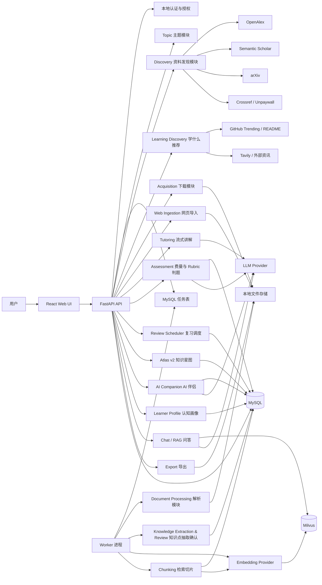

### 5.2 架构原则

- 领域模块不直接依赖外部 SDK，只依赖 Provider / Repository 接口。
- MySQL 是结构化业务数据的唯一事实源；向量和文件只保存可重建产物及其引用。
- 用户资料、学习记录、复习任务和授权记录必须有 `user_id` 数据归属。
- API 只接收请求和提供 SSE；解析、抽取、向量化等长任务由独立 Worker 执行。
- Worker 使用 MySQL 任务表、租约、幂等键和有限重试，不能依赖进程内 `BackgroundTasks` 保证任务完成。
- PDF 原文、解析文本、导出文档分开保存。
- 所有异步任务都要有状态机，不能只靠日志判断进度。
- 关键学习状态通过 `LearningEvent` 追溯；争议处理追加补偿事件，不覆盖历史。
- 默认 Strict Local；网页抓取权限与外部 AI 处理权限分别控制。

### 5.3 模块职责与依赖方向

后端采用“入口层 → 应用层 → 领域层 ← 基础设施层”的依赖规则。依赖指向领域定义的端口和数据结构，不能从领域反向依赖 FastAPI、SQLAlchemy、Milvus、文件系统或 Provider SDK。

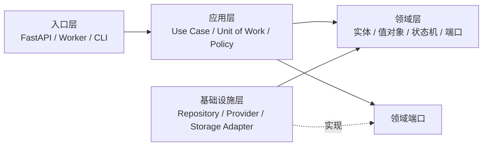

| 层级 | 唯一职责 | 允许依赖 | 禁止承担 |
|---|---|---|---|
| 入口层 | HTTP/SSE/Job 消息解析、认证上下文注入、DTO 转换和错误映射 | 应用层公开 Use Case | 领域判断、事务编排、Provider 选择、直接读写数据库 |
| 应用层 | 编排单个用例、事务边界、授权策略、幂等、Outbox 和跨模块流程 | 领域实体、领域服务和端口 | 供应商 SDK 调用、SQL 细节、HTTP 表达细节 |
| 领域层 | 业务不变量、状态转换、纯计算、领域事件和端口定义 | 标准库及领域内稳定类型 | FastAPI、SQLAlchemy、Milvus、文件路径、环境变量和外部 SDK |
| 基础设施层 | 实现 Repository、Provider、VectorStore、文件存储、时钟和消息端口 | 领域端口、第三方库和配置层 | 决定业务状态转换、静默 fallback、跨用例编排 |

API 与 Worker 是同一应用层的不同入口：API 创建命令、查询和持久化 Operation；Worker 领取持久化 Job 后调用同一个应用 Use Case。二者不得复制领域规则，Worker 也不得绕过授权、幂等和状态机直接更新业务终态。

领域模块所有权：

- `identity` 独占用户、认证凭据和登录 Session；其他模块只持有 `user_id`，不读取密码或 Session 内部状态。
- `privacy` 独占授权决策、Provider 凭据引用和审计策略；业务模块提交数据类别与处理目的，不自行判断是否允许外发。
- `topic` 独占 Topic 生命周期；资料、知识点和学习状态通过 ID 关联，不反向修改 Topic 内部状态。
- `ingestion` 独占 `SourceDocument`、`SourceRevision`、`IngestionRun` 及发布状态机，并通过端口编排 parser、chunker、embedding 和索引写入。
- `knowledge_extraction` 产生草稿，`knowledge_review` 独占草稿确认及正式 `KnowledgePoint` 创建；抽取模块不得直接发布正式知识点。
- `assessment` 独占 Rubric 判题与评分版本；`learning_events` 独占不可变学习事实；`review_scheduler` 只依据事实归约掌握度和复习任务，不改写评分历史。
- `tutoring`、后续 `rag`、`atlas`、`learner_profile` 和 `ai_companion` 只消费已发布知识与学习事实，不成为核心事实源。

跨模块协作规则：

1. 同一事务内的强一致修改只能由一个应用 Use Case 通过模块公开端口完成，Repository 不得互相调用。
2. 跨事务流程通过已提交的领域事件、Outbox 或显式应用编排推进；消费者必须幂等。
3. 跨模块查询使用只读 DTO 或 Query Service，不共享可变 ORM Entity。
4. Provider 选择由应用层结合 `privacy` 决策和版本化配置完成；Adapter 只执行已选择的调用并返回统一 DTO。
5. MySQL、Milvus 和文件卷的提交与补偿由 `ingestion` 应用用例按 D04 编排，基础设施 Adapter 不实现伪分布式事务。
6. API 错误由入口层按 D11 映射；第三方异常必须先在 Adapter 边界转换为稳定应用/领域错误。

公开接口以行为命名，例如 `StartIngestion`、`ApproveKnowledgePointDraft`、`SubmitAssessment` 和 `RecordReviewOutcome`。禁止暴露“任意更新实体”式接口，避免调用方绕过状态机。

## 6. 核心业务流程

### 6.1 MVP 闭环与目标演进

MVP 只实现以下纵向闭环：

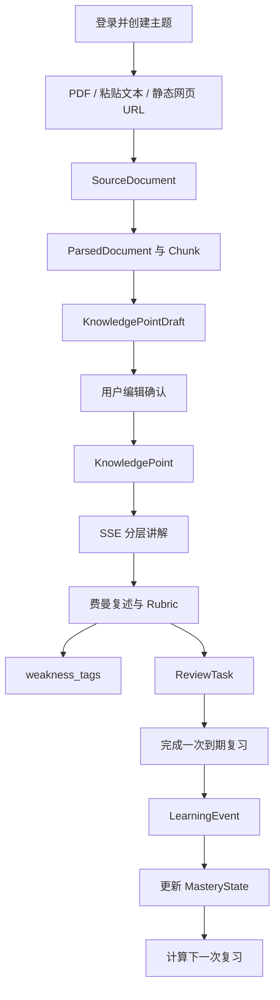

以下是后续阶段逐步扩展后的完整目标流程，不代表 MVP 同期实现：

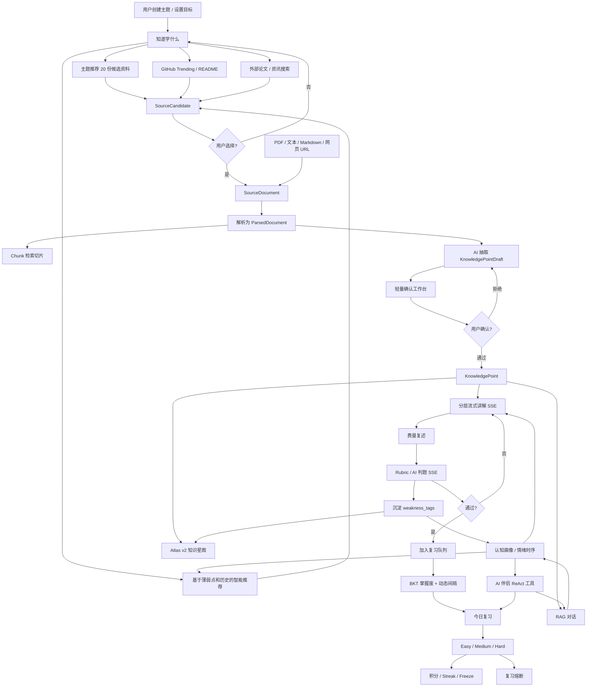

### 6.2 资料发现流程

输入：主题名称、主题描述、语言偏好、资料类型偏好。  
输出：候选资料列表。

步骤：

1. 根据主题生成检索查询。
2. 调用多个资料源 provider。
3. 将不同 provider 的结果归一化为 `SourceCandidate`。
4. 根据 DOI、标题相似度、PDF URL、年份做去重。
5. 按相关性、是否有 PDF、开放获取状态、年份排序。
6. 返回给用户选择。

### 6.3 资料入库流程

输入：用户选择的候选资料，或用户直接上传 / 粘贴 / 导入的资料。  
输出：可检索的 chunk、向量和待确认知识点草稿。

步骤：

1. 创建 `SourceDocument` 记录，状态为 `Selected` 或 `Created`。
2. 如果来源是候选资料，则执行下载或网页抽取；如果来源是本地上传 / 粘贴文本，则直接保存快照。
3. 保存原始文件、网页快照或文本快照，计算 `content_hash` / `sha256`。
4. 如果 hash 已存在，则复用已有资料或建立主题关联。
5. 解析资料，输出 `ParsedDocument`。
6. 按标题、段落、页码和语义边界切片。
7. 生成 embedding。
8. 写入 Milvus。
9. AI 抽取 `KnowledgePointDraft`。
10. 资料进入 `Indexed` / `Drafted` 状态，等待用户确认知识点。

### 6.4 Topic 内 Top 3 检索流程

输入：用户问题、用户选择的 Topic ID。  
输出：最多 3 个不同 `ParentChunk` 及其 PDF、页码和命中 Child 证据。

步骤：

1. 校验 Topic 归属及其 active 文档/Run。
2. 在 `user_id + topic_id + active_ingestion_run_id + source_state=active` 过滤范围内生成 query embedding。
3. Dense 通道召回 Child Top 20；BM25/稀疏通道召回 Child Top 20。
4. 使用 `retrieval-v1`、`k=60` 的 RRF 融合两个 Child 排名。
5. 按 `parent_chunk_id` 折叠；父块取最高 Child RRF 分数，不累加子块分数。
6. 对重复或高度重叠 Parent 去重，稳定排序后返回最多 3 个不同 Parent。
7. 每个 Parent 附带最多 2 个命中 Child，以及 PDF 标题、稳定文档 ID、版本 ID、页码和检索版本。

完整 Chat/RAG 阶段才增加 query rewrite、LLM 回答生成、对话持久化和 citation 编排；这些能力不得改变本节检索服务的确定性输入输出协议。

### 6.5 统一输入来源流程

所有输入来源都先归一化为 `SourceDocument`，后续解析、切片、知识点抽取和问答不直接关心来源差异。

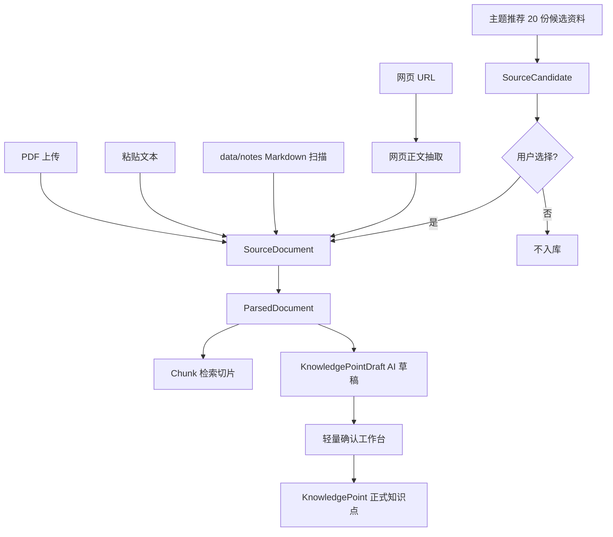

### 6.6 网页 URL 导入流程

输入：网页 URL。  
输出：可解析的 `SourceDocument`。

步骤：

1. 校验 URL 协议，只允许 `http` / `https`。
2. 执行 SSRF 防护，禁止访问本机、内网、文件协议和不可解析地址。
3. 下载 HTML，设置超时、大小上限和重定向上限。
4. 使用正文抽取器提取正文、标题、作者、发布时间等 metadata。
5. 将正文保存为 Markdown，同时保留原始 URL、抓取时间和正文 hash。
6. 创建 `SourceDocument`，进入统一解析流程。

### 6.7 主题推荐 20 份候选资料流程

输入：主题名称、主题描述、语言偏好、资料类型偏好。  
输出：20 条 `SourceCandidate`。

步骤：

1. 根据主题生成多个检索 query。
2. 调用 OpenAlex、Semantic Scholar、arXiv、Tavily 或其他 provider。
3. 合并结果，按 DOI、标题相似度、URL、PDF URL 去重。
4. 按相关性、资料质量、是否有 PDF、开放获取状态排序。
5. 返回固定 20 条候选资料。
6. 用户勾选后，候选资料才进入下载或导入流程。

关键约束：推荐结果不自动入库，不计入知识库，不绕过付费墙。

### 6.8 知识点确认流程

输入：`ParsedDocument`。  
输出：用户确认后的正式 `KnowledgePoint`。

步骤：

1. AI 从解析后的资料中抽取 `KnowledgePointDraft`。
2. 系统做初步去重和规范化。
3. 用户在轻量确认工作台查看草稿和来源引用。
4. 用户编辑标题、摘要、核心解释、标签、难度等核心字段。
5. 用户通过或拒绝草稿。
6. 通过后的草稿创建正式 `KnowledgePoint`。
7. 正式知识点才允许进入流式讲解、费曼考核、复习队列和知识星图。

### 6.9 知道学什么：学习发现流程

系统不只等待用户上传资料，也要主动帮助用户发现“下一步该学什么”。

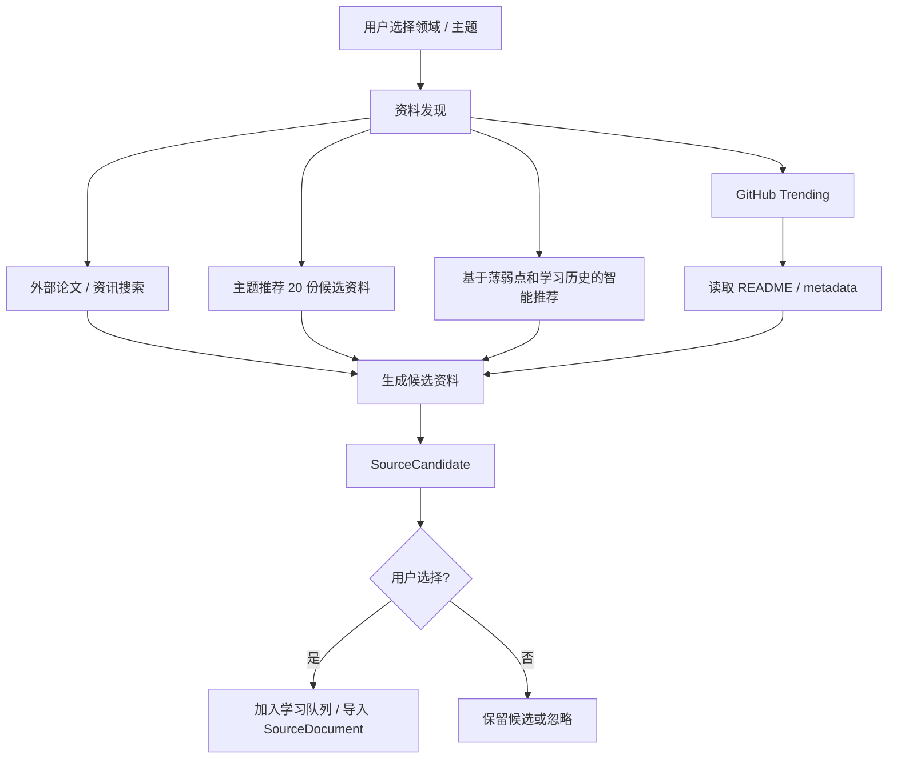

学习发现包含四类来源：

- GitHub 热门追踪：按语言、周期拉取 Trending 仓库，读取 README，形成候选学习资料。
- 外部论文 / 资讯搜索：在系统内搜索领域最新论文、技术报告和资讯，用户选择后直接入库。
- 主题候选推荐：围绕主题提供 20 份候选资料。
- 智能推荐：基于 `weakness_tags`、掌握度、复习历史、最近学习主题，推荐下一步该学什么。

### 6.10 学进去：分层讲解与 Rubric 判题流程

知识点不只是一段文本，而应被组织为分层结构：

- 大局观：这个知识点解决什么问题，为什么重要。
- 核心方法：核心机制、步骤、公式或架构。
- 实验证据：论文、数据、benchmark、案例或来源证据。
- 洞见：适用边界、常见误区、与其他知识点的联系。

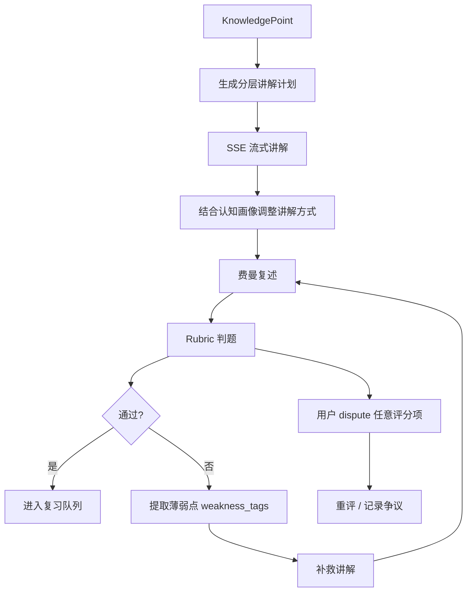

Rubric 判题要求：

- 默认维度为概念准确性 30%、关键要点覆盖 25%、因果 / 机制解释 20%、举例或迁移能力 15%、边界与误区 10%；不适用项可禁用并重新归一化权重。
- 每项使用 0-4 分锚点：0 为未提及或完全错误，4 为准确完整并能合理应用。
- 总分达到 70/100、概念准确性不低于 2/4 且不存在严重事实错误，才判定通过。
- 每条评分必须保存分数、来源依据、缺失点和改进建议。
- Easy 由用户自评，只产生弱学习证据；Medium 由 AI 判题并允许 dispute；Hard 使用完整费曼解释和追问，不能直接自评通过。
- dispute 创建新评分版本，原评分不可覆盖；重评推翻原判时追加补偿 `LearningEvent` 并重新归约掌握度。

### 6.11 不遗忘：BKT 调度与复习熔断流程

复习调度采用 BKT 掌握度估计 + 动态间隔公式，不使用固定间隔。调度结果只表示建议复习时间；复习不会自动弹窗或启动，只有用户主动进入复习模块、选择 Topic 并确认题目后才创建 `ReviewSession`。

默认间隔公式：

\[
intervalDays = clamp\left(7 \times \frac{\log(p_{mastery} / 0.4)}{\log(2)}, 0.5, 60\right)
\]

掌握度使用“证据锚点 + 时间衰减”双层表达。`MasteryState.p_mastery` 保存最近一次有效证据的 BKT 结果，对外展示和复习推荐使用当前有效掌握度：

\[
effectiveMastery(t) = 0.05 + (p_{mastery} - 0.05) \times 2^{-elapsedDays / halfLifeDays}
\]

首次通过后的 `halfLifeDays` 为 7 天，并限制在 0.5-180 天。成功时按 Easy / Medium / Hard 分别乘以 1.2 / 1.6 / 2.0，失败时分别乘以 0.9 / 0.6 / 0.5。衰减使用固定 `retention-decay-v1`，查询时按指定时间计算，不通过每日任务反复改写掌握度记录。

默认边界：

- `p_mastery` 限制在 0.05-0.98，新知识点初始值为 0.20。
- 首次费曼通过后，`p_mastery` 至少提升至 0.55，第一次建议复习固定安排在有效证据形成 12 小时后。
- 后续有效考核按公式调度，最小间隔为 0.5 天，最大间隔为 60 天；复习失败后的补救重试在 30 分钟后重新具备推荐资格。
- Easy 自评只产生弱更新；Medium 正常更新；Hard 产生强证据，失败时显著负向更新。
- Medium dispute 成功时追加补偿事件并重算，不删除或覆盖原学习事件。
- 用户在复习模块按 Topic 查看系统推荐候选，可增删知识点并自行选择本次数量；系统不设置每日或单 Session 固定 20 题限制。
- 未进入复习模块、逾期、延期或从候选列表移除都不产生失败事件；`effective_mastery(now)` 仍按统一时间衰减模型自然下降，而不是受到逾期惩罚。
- 新的有效考核到来时，先计算事件发生时的有效掌握度，再作为 `bkt-v1` 的先验形成新的证据锚点；补救讲解和页面行为不重置衰减时间。
- 积分和 streak 来源于真实完成的复习事件，不反向污染真实掌握度。
- Streak Freeze 只保护连续性，不增加掌握度。
- 手动延期保留原 `next_review_at`，通过独立 `defer_until` 暂时隐藏候选，单次最多延期 7 天。
- BKT 参数和调度公式分别保存在版本化配置中，避免把试验参数伪装成不可变常量。

### 6.12 用起来：RAG、Atlas v2 和 AI 伴侣流程

- RAG 对话支持回答“这周学了什么”“A 和 B 的区别”等问题，回答基于用户自己的知识库、学习历史和复习记录。
- Atlas v2 使用 Three.js 做 3D 知识星图，节点颜色表示掌握度，节点大小可表示重要度、失败次数或引用次数。
- AI 伴侣采用 ReAct 循环 + 工具调用，不是单纯聊天窗口。

AI 伴侣可用工具包括：

- 检索知识库。
- 查询今日复习队列。
- 分析薄弱点。
- 查看学习历史。
- 搜索外部论文 / 资讯。
- 推荐下一步学习内容。
- 生成学习路径。
- 发起知识点融合。

情感导师层作为 AI 伴侣的表达策略，不直接改写学习事实：

- 苏格拉底提问：通过问题帮助用户澄清理解。
- CBT 三步：识别想法、检验证据、替代解释。
- 反谄媚守卫：避免无原则赞同用户，必要时指出误解和薄弱假设。

### 6.13 越用越懂你：认知画像和情绪时序流程

系统持续沉淀三个长期画像：

- 认知画像：学习动机、偏好解释方式、学习障碍、生活阶段、常见误区。
- 情绪时序：每次对话结束后自动 diff 情绪变化，记录情绪基调、压力和阻塞点。
- 薄弱点图谱：费曼考核、Rubric 判题和复习失败持续沉淀到 `weakness_tags`。

隐私原则：

- 画像数据默认本地存储。
- 画像只用于调整讲解、推荐和复习策略。
- 用户应能查看、编辑、删除长期画像。
- 情绪推断不能作为医学诊断，只作为学习体验辅助信号。

## 7. 模块设计

建议按“领域模块 + 基础设施适配器”拆分，避免把外部 API、PDF 解析、向量库、LLM 调用混在一个大服务里。

### 7.1 Topic 模块

职责：管理用户主题。

核心能力：

- 创建、编辑、归档主题。
- 保存主题描述、关键词、语言偏好、资料类型偏好。
- 作为检索、资料、对话、导出的上层作用域。

不应承担的职责：

- 不直接调用搜索 API。
- 不处理 PDF。
- 不处理问答 prompt。

### 7.2 Discovery 模块

职责：根据主题发现资料候选。

核心能力：

- 查询多个资料源。
- 归一化元数据。
- 候选资料去重与排序。
- 标记 PDF 可用性和开放获取状态。

优先资料源：

- OpenAlex：开放学术知识图谱，适合获取作品、作者、来源、主题等元数据。
- Semantic Scholar API：适合检索论文、引用关系、摘要、PDF URL 等。
- arXiv：适合 AI、计算机、数学、物理等领域，PDF 获取稳定。
- Crossref：适合 DOI 和出版物元数据补全。
- Unpaywall：适合检查开放获取全文链接。
- 通用 Web Search：作为补充，不作为唯一来源。

关键边界：Discovery 只负责“找候选”，不负责“下载和入库”。

### 7.3 Web Ingestion 模块

职责：把用户提供的网页 URL 转换为可解析的本地资料。

核心能力：

- 校验 URL 协议，只允许 `http` / `https`。
- 做 SSRF 防护，禁止访问本机、内网地址和文件协议。
- 下载 HTML，并限制超时、大小和重定向次数。
- 抽取正文、标题、作者、发布时间等 metadata。
- 将正文保存为 Markdown，生成 `SourceDocument`。
- 保存原始 URL、抓取时间、正文 hash 和抽取状态。

推荐实现：

- MVP 优先使用 `trafilatura` 进行正文与 metadata 抽取。
- `readability-lxml` 作为备用抽取器。
- 动态网页抓取后置，必要时再引入 Playwright。

关键边界：Web Ingestion 只处理网页正文抽取，不负责知识点抽取和问答。

### 7.4 Acquisition 模块

职责：下载用户确认的资料。

核心能力：

- 下载 PDF。
- 校验 MIME 类型和文件扩展名。
- 限制文件大小。
- 计算 hash 并去重。
- 记录下载状态、失败原因、重试次数。

关键边界：Acquisition 只处理“拿到原始文件”，不负责解析内容。

### 7.5 Document Processing 模块

职责：把 PDF 转成可切片的结构化文本。

推荐策略：

- 第一阶段使用 PyMuPDF / PyMuPDF4LLM。
- 输出 Markdown，尽量保留标题、表格、页码线索。
- 对扫描版 PDF 标记为 `requires_ocr`，OCR 后置。
- 输出统一的 `ParsedDocument`，下游不依赖具体解析库。

建议内部结构：

```text
ParsedDocument
  source_document_id
  title
  pages[]
    page_number
    markdown
    text
    blocks[]
      type
      content
      bbox 可选
```

### 7.6 Chunking 模块

职责：为每个不可变资料版本生成父子文档结构，父块负责完整上下文，子块负责 Dense/BM25 精确召回。

结构关系：

```text
SourceDocument
└── SourceRevision
    └── IngestionRun
        └── ParentChunk[]
            └── ChildChunk[]
```

默认父子切片规则：

- `SourceDocument` 为每份逻辑 PDF 提供稳定标识，`SourceRevision` 标识具体文件版本，`IngestionRun` 标识具体解析和索引版本。
- Parent 以 Markdown 标题、语义段落、页码连续性为优先边界，目标约 1200-2500 tokens，负责回源和上下文编排。
- Child 在单个 Parent 内继续切分，目标约 300-600 tokens，overlap 约 60-100 tokens，负责 Dense 与 BM25 索引。
- overlap 不得跨 Parent；表格、公式、代码块和列表尽量保持完整。
- 每个 Child 只属于一个 Parent；父子块不能跨 Revision 或 Run。
- 单个 Run 最多 1500 个可索引 ChildChunk。
- 父子 ID 根据 Run、块序号和 `chunking_version` 确定性生成，重试保持相同 ID，规则变化创建新版本。

Parent metadata 最少包含：

- `user_id`
- `topic_id`
- `source_document_id`
- `source_revision_id`
- `ingestion_run_id`
- `parent_chunk_id`
- `parent_ordinal`
- `heading_path`
- `page_start` / `page_end`
- 字符区间、token 数和正文引用

Child metadata 最少包含：

- 全部父级身份字段
- `child_chunk_id`
- `child_ordinal`
- 父内字符区间
- `page_start` / `page_end`
- `token_count`
- Dense / Sparse 索引版本
- 正文引用

关键边界：Parent 和 Child 是同一 `IngestionRun` 的不可变派生产物。Milvus 保存 Child 的检索索引与必要 metadata，父块完整正文仍从本机业务存储回源；检索 Chunk 不得自动升级为正式知识点。

### 7.7 Knowledge Extraction & Review 模块

职责：从解析后的资料中抽取学习型知识点草稿，并通过用户确认后生成正式知识点。

核心能力：

- 基于 `ParsedDocument` 生成 `KnowledgePointDraft`；知识点必须能够被单独解释、复述、判题和更新掌握度。
- 每 1000-2000 个有效字符建议抽取 3-5 个草稿，单个来源默认最多 20 个；这是质量软约束，不得为凑数量制造伪知识点。
- 草稿必须包含 `title`、`summary`、`core_explanation`、`layered_structure`、`source_refs`、`initial_rubric`、`suggested_difficulty` 和 `review_policy`。
- `layered_structure` 使用 `overview`、`core_method`、`evidence`、`insight`，允许不适用的层为空，避免强制生成虚假实验证据。
- 抽取失败时依次执行：同模型重试一次、缩小输入分段抽取、标记 `extraction_failed`、允许用户手动创建；检索 Chunk 不得自动升级为正式知识点。
- 对 AI 草稿做初步去重、标题规范化和来源引用绑定。
- 提供轻量版确认工作台所需的数据结构。
- 支持用户编辑标题、摘要、核心解释、标签、难度和 `review_policy`。
- 支持用户通过或拒绝草稿。
- 通过后的草稿才能创建正式 `KnowledgePoint`。
- 记录 `KnowledgePointReview`，保留用户编辑、通过、拒绝等审阅轨迹。

MVP 边界：

- 必须支持查看、编辑、通过、拒绝。
- 暂缓复杂合并 / 拆分交互。
- 数据模型和 API 预留 `merge`、`split`，避免后续破坏兼容性。

关键约束：

- `KnowledgePointDraft` 不是正式知识点。
- 未确认草稿不能进入流式讲解、费曼考核、复习队列、知识星图和 AI 伴侣长期记忆。
- 来源引用不能丢，用户编辑后仍必须保留原始 `source_refs`。

### 7.8 Learning Discovery 模块

职责：帮助用户知道下一步该学什么。

核心能力：

- GitHub 热门追踪：按语言、周期拉取 Trending 仓库，读取 README 和 metadata，生成 `SourceCandidate`。
- 外部论文 / 资讯搜索：调用论文 API、Tavily 或其他搜索 provider，生成可入库候选资料。
- 智能推荐：基于 `weakness_tags`、掌握度、复习失败记录、学习历史和用户目标推荐下一步学习内容。
- 推荐结果只生成候选，不自动污染知识库。

关键边界：Learning Discovery 负责“推荐该学什么”，不负责资料解析、知识点抽取和复习调度。

### 7.9 Tutoring 模块

职责：把正式 `KnowledgePoint` 讲给用户听，并根据认知画像调整讲解方式。

核心能力：

- 生成分层讲解计划：大局观、核心方法、实验证据、洞见。
- 使用 SSE 流式输出讲解内容。
- 根据认知画像调整讲解方式，例如偏概念、偏例子、偏类比、偏公式。
- 讲解结束后触发费曼考核。

关键边界：Tutoring 不直接更新掌握度，只产生学习事件和考核入口。

### 7.10 Assessment 模块

职责：处理费曼考核、Rubric 判题和 dispute。

核心能力：

- 生成知识点级 Rubric。
- 对用户复述逐条评分。
- 使用 SSE 流式返回 AI 判题过程。
- 自动提取薄弱点并写入 `weakness_tags`。
- 支持用户 dispute 任意评分项。
- dispute 后进入重评或人工确认路径。

判题约束：

- Easy：用户自评。
- Medium：AI 判题 + 允许逃生 / dispute。
- Hard：AI 强判，失败后进入补救讲解。

### 7.11 Review Scheduler 模块

职责：根据掌握度和复习事件生成今日复习队列。

核心能力：

- 使用 BKT 更新掌握度。
- 使用带边界的动态间隔公式计算下次复习时间：`clamp(7 × log(p_mastery/0.4) / log(2), 0.5, 60)`。
- `p_mastery` 限制在 0.05-0.98，参数通过版本化 `MasteryModelConfig` 管理。
- Easy / Medium / Hard 只影响学习证据强度；状态变化通过 `LearningEvent` 归约。
- 记录积分、Streak、Streak Freeze。
- 支持复习熔断：积压过多时延期轻松题，优先保留薄弱和高重要度知识点。

关键边界：积分和 streak 只由学习事件推导，不反向修改真实掌握度。

### 7.12 Atlas 模块

职责：提供 Atlas v2 3D 知识星图。

核心能力：

- 使用 Three.js / 3D 图谱展示知识点。
- 节点颜色表示掌握度。
- 节点大小表示重要度、失败次数或引用次数。
- 支持语义检索高亮相关节点。
- 支持点击节点查看来源、掌握度、复习历史、薄弱标签。

关键边界：Atlas 是知识图谱和掌握度的可视化投影，不维护另一套学习状态。

### 7.13 AI Companion 模块

职责：提供理解用户学习状态的 AI 伴侣。

核心能力：

- 使用 ReAct 循环和工具调用。
- 能查询复习队列、薄弱点、学习历史、知识库检索结果和推荐内容。
- 支持跨会话记忆。
- 支持情感导师层：苏格拉底提问、CBT 三步、反谄媚守卫。

关键边界：AI 伴侣不能绕过业务 API 直接修改核心学习状态；有副作用的动作必须显式确认。

### 7.14 Learner Profile 模块

职责：维护越用越懂用户的长期画像。

核心能力：

- 认知画像：学习动机、解释偏好、学习障碍、生活阶段。
- 情绪时序：每次对话结束后自动 diff 情绪变化。
- 薄弱点图谱：从费曼考核、Rubric 判题、复习失败中沉淀 `weakness_tags`。
- 支持用户查看、编辑、删除画像数据。

关键边界：画像用于学习体验优化，不作为医学诊断或不可解释的推荐黑箱。

### 7.15 Embedding 模块

职责：把 chunk 文本转为向量。

核心能力：

- 批量 embedding。
- 记录 embedding 模型名称和维度。
- 处理 provider 限流和失败重试。
- 支持后续重建索引。

关键边界：Embedding 模块不关心 PDF 和对话，只处理文本到向量。

### 7.16 Retrieval Index 模块

职责：发布并查询 Child 的 Dense/BM25 双路索引，不承担父块正文事实存储。

推荐默认：Milvus Dense + Sparse/BM25 能力；若具体 BM25 实现采用独立适配器，也必须服从同一 `retrieval-v1` 协议。

核心能力：

- 以确定性 `child_chunk_id` 幂等 upsert Dense 与 Sparse 索引。
- 召回前按 `user_id`、`topic_id`、active Run 和资料状态过滤。
- Dense 与 BM25 各返回 Child Top 20。
- 使用 `k=60` 的 RRF 融合，不比较两类原始分数。
- 按 Parent 折叠并去除重复/高度重叠父块，最终返回 Top 3 不同 Parent。
- 支持索引版本切换、整 Run 重建和删除补偿。

关键边界：父块正文从本机业务存储回源；每个 Parent 只以最高 RRF Child 计分，避免子块数量影响排名。

### 7.17 Chat / RAG 模块

职责：围绕资料进行一对一交流。

核心能力：

- 查询重写。
- 主题内检索。
- rerank。
- prompt 构造。
- 带引用回答。
- 对话记录持久化。

回答原则：

- 回答必须尽量引用来源。
- 不允许把模型常识伪装成资料结论。
- 如果证据不足，必须明确说明。
- 如果使用模型常识，应标注“补充解释，非资料直接引用”。

### 7.18 Export 模块

职责：把交流过程导出为 Markdown。

核心能力：

- 导出完整对话。
- 导出资料清单。
- 导出引用来源。
- 可选生成摘要版导出。

关键边界：默认导出不重新调用 LLM，避免导出内容与原始对话不一致。只有用户选择“摘要版导出”时才调用 LLM。

### 7.19 前端关键交互

前端只处理交互状态，不承载资料解析、知识点抽取、向量检索和 RAG 业务逻辑。

核心功能区建议按五组组织：

- 知道学什么：主题候选资料、GitHub Trending、外部论文 / 资讯搜索、智能推荐。
- 学进去：待学新知、知识点确认工作台、SSE 流式讲解、费曼考核、Rubric 判题。
- 不遗忘：今日复习、Easy / Medium / Hard、积分、Streak、Streak Freeze、复习熔断提示。
- 用起来：RAG 对话、Atlas v2 知识星图、AI 伴侣。
- 越用越懂你：认知画像、情绪时序、薄弱点图谱。

MVP 的“待学新知”页面只提供三个输入入口：

- 上传文本型 PDF。
- 粘贴文本。
- 导入静态网页 URL。

后续阶段再增加 `data/notes/` 扫描和“主题推荐 20 份候选资料”。候选推荐结果进入独立候选资料页面，不直接进入学习；用户选择后才转换为 `SourceDocument`。

轻量版知识点确认工作台是 MVP 必须实现的质量控制界面。推荐布局：

- 左侧：原文片段 / 来源引用。
- 中间：AI 抽取的知识点草稿列表。
- 右侧：当前草稿编辑器。
- 底部：保存编辑、通过、拒绝。

Rubric 判题界面必须展示每条评分条件、得分、判分证据、缺失点和 dispute 入口。

今日复习界面必须突出：今日剩余量、积压风险、熔断建议、Streak / Freeze 状态。

Atlas v2 页面使用 Three.js 3D 视图，节点颜色表示掌握度，点击节点查看来源、薄弱标签、复习历史和相关知识点。

AI 伴侣界面需要明确展示工具调用记录；有副作用动作必须二次确认。

MVP 不强制支持合并 / 拆分按钮，但后端数据模型和 API 预留该能力。

## 8. 数据模型

### 8.0 数据归属与一致性规则

- MySQL 保存全部结构化业务数据，是事务和恢复的唯一事实源。
- `User` 拥有资料、主题和个人学习状态；除纯系统配置外，业务聚合根必须包含 `user_id`。
- Milvus 只保存向量及 MySQL 记录 ID，不承载不可重建的业务状态。
- 本地卷保存原始文件和派生产物，MySQL 保存路径、hash、版本和处理状态。
- 判题、掌握度和调度变化通过 `LearningEvent` 追加记录；历史事件不可原地覆盖。
- 一次判题引起的 `AssessmentAttempt`、`weakness_tags`、`LearningEvent`、`MasteryState` 和 `ReviewTask` 变更必须在同一个 MySQL 事务内完成。

核心聚合与事实属性：

| 聚合/资源 | 所有者模块 | 身份与版本边界 | 事实属性 |
|---|---|---|---|
| `User` / 登录 Session | `identity` | `user_id`；Session 独立过期与撤销 | 认证事实，不与学习 Session 共用状态 |
| `Topic` | `topic` | 用户内稳定 `topic_id` | 组织关系，不拥有资料或学习历史生命周期 |
| `SourceDocument` | `ingestion` | 逻辑资料稳定 ID | 生命周期聚合根 |
| `SourceRevision` | `ingestion` | 不可变内容版本 | 版本事实；active 指针只引用已验证版本 |
| `IngestionRun` | `ingestion` | Revision + 配置摘要 + Run ID | 不可变派生流水线；只整体发布 |
| `KnowledgePointDraft` | `knowledge_review` | Run 内草稿及版本链 | 审核前候选，不是正式知识事实 |
| `KnowledgePoint` / SourceRef | `knowledge_review` | 用户内稳定概念 + 多来源引用 | 用户确认后的知识事实 |
| `AssessmentAttempt` / GradeVersion | `assessment` | Attempt 和不可变评分版本 | 判题事实；dispute 追加版本 |
| `LearningEvent` | `learning_events` | 知识点级 sequence + 幂等键 | 不可变学习事实源 |
| `MasteryState` | `review_scheduler` | 知识点 + 模型版本 | 可由事件重建的投影 |
| `ReviewTask` / `ReviewSession` | `review_scheduler` | 调度版本与 Session 快照 | 建议和执行状态，不反向改写历史事件 |
| `GenerationSession` / `Operation` | 应用层会话与任务模块 | 幂等键 + 业务对象版本 | 持久化流程资源；SSE 连接只是观察者 |

全局数据与状态规则：

1. 所有用户数据查询和唯一约束均包含 `user_id`；业务 ID、内容 hash 或 Milvus 主键不能替代授权条件。
2. 不可变事实只能追加或通过新版本/补偿事实纠正；禁止原地覆盖 Revision、评分版本和 `LearningEvent`。
3. active 指针、投影和任务进度是可变状态，必须通过版本检查、行锁或 `If-Match` 防止最后写入覆盖。
4. 状态命令只能执行状态图列出的边；对已达目标状态的同幂等命令返回首次结果，其他非法边返回稳定冲突错误。
5. 外部副作用在事务提交后通过 Outbox 执行；Adapter 结果只有通过校验并完成发布事务后才对普通查询可见。
6. 删除遵循聚合所有权：Topic 删除不级联资料；资料删除不级联正式知识点与学习事实；投影可重建但事实与最小墓碑按 D07 保留。
7. 时间戳存 UTC，顺序由服务端生成；客户端时间只用于展示，不决定事件顺序、租约或到期判断。

### 8.0.1 User

| 字段 | 类型 | 说明 |
| --- | --- | --- |
| `id` | string | 用户 ID |
| `username` | string | 本地唯一用户名 |
| `password_hash` | string | 强哈希后的密码，不保存明文 |
| `status` | string | `active` / `disabled` |
| `created_at` | datetime | 创建时间 |
| `updated_at` | datetime | 更新时间 |

MVP 只创建一个本地管理员用户，但所有个人数据仍显式关联 `user_id`。

### 8.0.2 UserPrivacySettings

| 字段 | 类型 | 说明 |
| --- | --- | --- |
| `user_id` | string | 用户 ID |
| `mode` | string | `strict_local` / `online_enhanced` |
| `network_fetch_enabled` | bool | 是否允许用户主动提交的 URL 抓取 |
| `external_search_enabled` | bool | 是否允许外部公开资料搜索 |
| `cloud_knowledge_content` | bool | 是否允许云模型处理知识点内容 |
| `cloud_user_answer` | bool | 是否允许云模型处理用户复述 |
| `cloud_embedding` | bool | 是否允许云端 Embedding |
| `cloud_learning_summary` | bool | 是否允许发送学习历史摘要，MVP 默认关闭 |
| `updated_at` | datetime | 更新时间 |

认知画像和情绪内容不得被总开关隐式授权；如未来开放，必须使用单独、明确且可撤销的授权。

### 8.0.3 ProviderConsentAudit

记录每次外部能力授权的 Provider、模型、数据类别、目的、授权来源和时间，不保存完整 Prompt 或敏感正文。

### 8.0.4 BackgroundJob

| 字段 | 类型 | 说明 |
| --- | --- | --- |
| `id` | string | 任务 ID |
| `user_id` | string | 所属用户 |
| `job_type` | string | 解析、抽取、向量化等任务类型 |
| `resource_id` | string | 关联业务资源 ID |
| `status` | string | `pending` / `leased` / `running` / `succeeded` / `failed` / `cancelled` |
| `idempotency_key` | string | 幂等键 |
| `lease_owner` | string nullable | 当前 Worker |
| `lease_expires_at` | datetime nullable | 租约到期时间 |
| `progress` | float | 进度 0-1 |
| `retry_count` | int | 已重试次数 |
| `last_error` | text nullable | 脱敏错误摘要 |
| `created_at` | datetime | 创建时间 |
| `updated_at` | datetime | 更新时间 |

### 8.1 Topic

| 字段 | 类型 | 说明 |
| --- | --- | --- |
| `id` | string | 主题 ID |
| `name` | string | 主题名称 |
| `description` | string | 主题描述 |
| `language` | string | 语言偏好 |
| `query_profile` | json | 检索偏好 |
| `created_at` | datetime | 创建时间 |
| `archived_at` | datetime nullable | 归档时间 |

### 8.2 SourceCandidate

| 字段 | 类型 | 说明 |
| --- | --- | --- |
| `id` | string | 候选资料 ID |
| `topic_id` | string | 所属主题 |
| `source_provider` | string | 来源 provider |
| `candidate_type` | string | `pdf` / `webpage` / `paper` / `markdown` / `report` / `github_repo` / `news` |
| `rank` | int | 在 20 条候选资料中的排序 |
| `title` | string | 标题 |
| `authors` | json | 作者列表 |
| `abstract` | text | 摘要 |
| `year` | int nullable | 年份 |
| `doi` | string nullable | DOI |
| `landing_url` | string | 详情页 URL |
| `pdf_url` | string nullable | PDF URL |
| `license` | string nullable | 许可证 |
| `availability` | string | `direct_pdf` / `landing_page` / `manual_upload_required` |
| `recommendation_reason` | text | 推荐理由 |
| `score` | float | 相关性分数 |
| `selected_by_user` | bool | 是否被用户选择 |
| `selected_at` | datetime nullable | 用户选择时间 |

### 8.3 SourceDocument、SourceRevision 与 IngestionRun

`SourceDocument` 是逻辑资料的稳定身份；每次替换、重新抓取或明确重新上传创建不可变 `SourceRevision`，每次解析和索引构建创建 `IngestionRun`。

#### SourceDocument

| 字段 | 类型 | 说明 |
| --- | --- | --- |
| `id` | string | 稳定 `source_document_id` |
| `user_id` | string | 所属用户 |
| `topic_id` | string | 所属主题 |
| `candidate_id` | string nullable | 来源候选资料 |
| `input_type` | string | `pdf_upload` / `paste_text` / `web_url` 等 |
| `title` | string | 当前展示标题 |
| `state` | string | `active` / `archived` / `trashed` / `purging` / `purged` |
| `active_revision_id` | string nullable | 当前生效 Revision |
| `source_missing` | bool | 当前是否缺少有效来源 |
| `created_at` | datetime | 创建时间 |
| `updated_at` | datetime | 更新时间 |

#### SourceRevision

| 字段 | 类型 | 说明 |
| --- | --- | --- |
| `id` | string | `source_revision_id` |
| `user_id` | string | 所属用户 |
| `source_document_id` | string | 逻辑资料 ID |
| `content_blob_id` | string | 内容寻址原件 |
| `original_url` | string nullable | 原始 URL |
| `mime_type` | string nullable | MIME 类型 |
| `page_count` | int nullable | 页数 |
| `content_hash` | string | 规范化内容 hash |
| `sha256` | string nullable | 二进制文件 hash |
| `active_ingestion_run_id` | string nullable | 当前已发布 Run |
| `created_at` | datetime | 创建时间 |

#### ContentBlob

| 字段 | 类型 | 说明 |
| --- | --- | --- |
| `id` | string | Blob ID |
| `user_id` | string | 去重边界 |
| `content_hash` | string | 用户内内容寻址键 |
| `storage_path` | string | 原始文件或文本快照路径 |
| `byte_size` | int | 字节数 |
| `created_at` | datetime | 创建时间 |

#### IngestionRun

| 字段 | 类型 | 说明 |
| --- | --- | --- |
| `id` | string | `ingestion_run_id` |
| `user_id` | string | 所属用户 |
| `source_document_id` | string | 逻辑资料 ID |
| `source_revision_id` | string | 不可变资料版本 |
| `status` | string | `queued` / `running` / `validating` / `publishing` / `published` / `cancel_requested` / `compensating` / `failed` / `cancelled` / `compensation_failed` |
| `checkpoint` | string | `parsing` / `extracting` / `chunking` / `embedding` 等当前可重试检查点 |
| `parser_version` | string | 解析器版本 |
| `chunking_version` | string | 父子切片版本 |
| `embedding_index_version` | string | Dense 索引版本 |
| `sparse_index_version` | string | BM25/Sparse 索引版本 |
| `config_snapshot` | json | 本 Run 固化参数；不受后续 `.env` 修改影响 |
| `started_at` | datetime nullable | 开始时间 |
| `published_at` | datetime nullable | 发布时间 |
| `created_at` | datetime | 创建时间 |

### 8.4 ParentChunk 与 ChildChunk

Parent 保存可返回上下文，Child 负责 Dense/BM25 精确召回。父子块属于不可变 Run，不能跨 Revision 或 Run。

#### ParentChunk

| 字段 | 类型 | 说明 |
| --- | --- | --- |
| `id` | string | 确定性 `parent_chunk_id` |
| `user_id` | string | 所属用户 |
| `topic_id` | string | 召回过滤字段 |
| `source_document_id` | string | 逻辑资料 ID |
| `source_revision_id` | string | 资料版本 ID |
| `ingestion_run_id` | string | Run ID |
| `parent_ordinal` | int | Run 内顺序 |
| `heading_path` | string | 标题路径 |
| `page_start` / `page_end` | int nullable | 页码范围 |
| `char_start` / `char_end` | int | 解析正文字符范围 |
| `content_path` | string | 本机父块正文引用 |
| `token_count` | int | token 数 |

#### ChildChunk

| 字段 | 类型 | 说明 |
| --- | --- | --- |
| `id` | string | 确定性 `child_chunk_id` |
| `parent_chunk_id` | string | 唯一所属 Parent |
| `user_id` | string | 所属用户 |
| `topic_id` | string | 召回过滤字段 |
| `source_document_id` | string | 逻辑资料 ID |
| `source_revision_id` | string | 资料版本 ID |
| `ingestion_run_id` | string | Run ID |
| `child_ordinal` | int | Parent 内顺序 |
| `page_start` / `page_end` | int nullable | 页码范围 |
| `char_start` / `char_end` | int | Parent 内字符范围 |
| `content` | text | Child 检索文本 |
| `token_count` | int | token 数 |
| `dense_index_version` | string | Dense 版本 |
| `sparse_index_version` | string | BM25/Sparse 版本 |

### 8.5 KnowledgePoint 与 KnowledgePointSourceRef

`KnowledgePoint` 是用户确认后的跨资料稳定概念，不把单个来源写死在聚合根。来源事实由多值关系表维护。

#### KnowledgePoint

| 字段 | 类型 | 说明 |
| --- | --- | --- |
| `id` | string | 知识点 ID |
| `user_id` | string | 所属用户 |
| `topic_id` | string | 所属主题 |
| `draft_id` | string nullable | 初始草稿 |
| `title` | string | 标题 |
| `summary` | text | 一句话摘要 |
| `content` | text | 核心解释 |
| `tags` | json | 标签 |
| `weakness_tags` | json | 薄弱点标签 |
| `layered_structure` | json | 大局观、核心方法、实验证据、洞见 |
| `difficulty` | string | 难度 |
| `source_missing` | bool | 是否没有有效来源 |
| `semantic_version` | int | 语义版本；驱动 Rubric supersede |
| `status` | string | 学习状态 |
| `created_at` | datetime | 创建时间 |
| `updated_at` | datetime | 更新时间 |

#### KnowledgePointSourceRef

| 字段 | 类型 | 说明 |
| --- | --- | --- |
| `id` | string | 来源关系 ID |
| `user_id` | string | 所属用户 |
| `knowledge_point_id` | string | 知识点 ID |
| `source_document_id` | string | 逻辑资料 ID |
| `source_revision_id` | string | 证据版本 ID |
| `parent_chunk_id` | string nullable | 父块证据 |
| `child_chunk_id` | string nullable | 精确命中证据 |
| `page_start` / `page_end` | int nullable | 页码范围 |
| `quote` | text nullable | 必要的来源摘录 |
| `state` | string | `active` / `inactive` / `purged` |
| `created_at` | datetime | 创建时间 |

### 8.6 KnowledgePointDraft

AI 抽取结果先进入草稿，用户确认前不能进入讲解、考核或复习。

| 字段 | 类型 | 说明 |
| --- | --- | --- |
| `id` | string | 草稿 ID |
| `user_id` | string | 所属用户 |
| `source_document_id` | string | 来源逻辑资料 ID |
| `source_revision_id` | string | 来源版本 ID |
| `ingestion_run_id` | string | 产生草稿的 Run |
| `title` | string | 标题 |
| `summary` | text | 一句话摘要 |
| `content` | text | 核心解释 |
| `tags` | json | 标签 |
| `layered_structure` | json | 分层结构 |
| `review_policy` | string | `required` / `optional` / `excluded` |
| `suggested_difficulty` | string | AI 建议难度 |
| `difficulty` | string | 用户确认难度 |
| `source_refs_snapshot` | json | 不可变来源审计快照 |
| `assessment_questions` | json | 费曼候选问题 |
| `prompt_version` | string | 抽取 Prompt 版本 |
| `schema_version` | string | 输出 schema 版本 |
| `model_ref` | string | Provider/模型标识 |
| `status` | string | `generated` / `editing` / `approved` / `rejected` / `superseded` |
| `ai_confidence` | float nullable | AI 置信度 |
| `created_at` | datetime | 创建时间 |
| `updated_at` | datetime | 更新时间 |

MVP 只使用 `generated`、`editing`、`approved`、`rejected`；后续合并/拆分使用 `superseded`，不改写历史草稿。

### 8.7 KnowledgePointReview

记录用户对草稿的审阅轨迹，保证知识点生成可追溯。

| 字段 | 类型 | 说明 |
| --- | --- | --- |
| `id` | string | 审阅记录 ID |
| `draft_id` | string | 草稿 ID |
| `action` | string | `edit` / `approve` / `reject` / `merge` / `split` |
| `before_snapshot` | json nullable | 修改前快照 |
| `after_snapshot` | json nullable | 修改后快照 |
| `reviewed_at` | datetime | 审阅时间 |

MVP 只使用 `edit`、`approve`、`reject`。`merge`、`split` 先预留。

### 8.8 AssessmentRubric

| 字段 | 类型 | 说明 |
| --- | --- | --- |
| `id` | string | Rubric ID |
| `knowledge_point_id` | string | 所属知识点 |
| `criteria` | json | 评分条件列表 |
| `max_score` | int | 最高分 |
| `created_by` | string | `llm` / `user` |
| `created_at` | datetime | 创建时间 |

### 8.9 AssessmentAttempt

| 字段 | 类型 | 说明 |
| --- | --- | --- |
| `id` | string | 考核记录 ID |
| `knowledge_point_id` | string | 知识点 ID |
| `rubric_id` | string nullable | 使用的 Rubric |
| `mode` | string | `feynman` / `review_easy` / `review_medium` / `review_hard` |
| `answer` | text | 用户复述或答案 |
| `score` | float | 总分 |
| `passed` | bool | 是否通过 |
| `weakness_tags` | json | 本次提取出的薄弱点标签 |
| `feedback` | text | 总体反馈 |
| `created_at` | datetime | 创建时间 |

### 8.10 RubricScoreItem

| 字段 | 类型 | 说明 |
| --- | --- | --- |
| `id` | string | 单项评分 ID |
| `assessment_attempt_id` | string | 所属考核 |
| `criterion_key` | string | 评分项 key |
| `score` | float | 单项分数 |
| `evidence` | text | 判分证据 |
| `missing_points` | json | 缺失点 |
| `disputed` | bool | 用户是否 dispute |
| `dispute_status` | string nullable | `pending` / `accepted` / `rejected` / `resolved` |

### 8.11 MasteryState

| 字段 | 类型 | 说明 |
| --- | --- | --- |
| `knowledge_point_id` | string | 知识点 ID |
| `p_mastery` | float | BKT 掌握度 |
| `stability` | float | 记忆稳定度 |
| `difficulty` | float | 个体化难度 |
| `review_count` | int | 复习次数 |
| `correct_count` | int | 通过次数 |
| `last_reviewed_at` | datetime nullable | 上次复习时间 |
| `next_review_at` | datetime nullable | 下次复习时间 |
| `updated_at` | datetime | 更新时间 |

### 8.12 ReviewTask

| 字段 | 类型 | 说明 |
| --- | --- | --- |
| `id` | string | 复习任务 ID |
| `user_id` | string | 所属用户 |
| `knowledge_point_id` | string | 知识点 ID |
| `due_at` | datetime | 应复习时间 |
| `original_due_at` | datetime | 首次计划时间，延期时不覆盖 |
| `difficulty_mode` | string | `easy` / `medium` / `hard` |
| `priority` | float | 优先级 |
| `status` | string | `scheduled` / `due` / `in_progress` / `done` / `postponed` |
| `postpone_reason` | string nullable | 延期原因，例如复习熔断 |

### 8.12.1 LearningEvent

| 字段 | 类型 | 说明 |
| --- | --- | --- |
| `id` | string | 学习事件 ID |
| `user_id` | string | 所属用户 |
| `knowledge_point_id` | string | 关联知识点 |
| `event_type` | string | 讲解完成、判题、复习、dispute 补偿等事件 |
| `evidence_strength` | float | Easy / Medium / Hard 对应的证据强度 |
| `payload` | json | 版本化事件数据 |
| `causation_id` | string nullable | 导致本事件的命令或事件 |
| `correlation_id` | string | 一次学习流程的关联 ID |
| `model_version` | string nullable | 使用的 BKT 参数版本 |
| `created_at` | datetime | 创建时间 |

### 8.12.2 MasteryModelConfig

| 字段 | 类型 | 说明 |
| --- | --- | --- |
| `version` | string | 参数版本 |
| `p_init` | float | 初始掌握度，默认 0.20 |
| `p_learn` | float | 学习转移概率 |
| `p_guess` | float | 猜对概率 |
| `p_slip` | float | 已掌握但答错概率 |
| `evidence_weights` | json | Easy / Medium / Hard 证据权重 |
| `min_interval_days` | float | 默认 0.5 天 |
| `max_interval_days` | float | 默认 60 天 |
| `created_at` | datetime | 创建时间 |

### 8.13 RewardEvent

| 字段 | 类型 | 说明 |
| --- | --- | --- |
| `id` | string | 奖励事件 ID |
| `event_type` | string | `review_done` / `hard_passed` / `streak_bonus` / `freeze_used` |
| `points` | int | 积分变化 |
| `reason` | text | 原因 |
| `created_at` | datetime | 创建时间 |

### 8.14 StreakState

| 字段 | 类型 | 说明 |
| --- | --- | --- |
| `id` | string | 连击状态 ID |
| `current_streak` | int | 当前连续天数 |
| `longest_streak` | int | 最长连续天数 |
| `freeze_count` | int | 可用 Streak Freeze 数量 |
| `last_active_date` | date | 最近活跃日期 |
| `updated_at` | datetime | 更新时间 |

### 8.15 LearningRecommendation

| 字段 | 类型 | 说明 |
| --- | --- | --- |
| `id` | string | 推荐 ID |
| `topic_id` | string nullable | 关联主题 |
| `reason_type` | string | `weakness` / `history` / `github_trending` / `paper_search` / `manual_topic` |
| `title` | string | 推荐标题 |
| `reason` | text | 推荐理由 |
| `candidate_id` | string nullable | 对应候选资料 |
| `status` | string | `pending` / `accepted` / `dismissed` |
| `created_at` | datetime | 创建时间 |

### 8.16 LearnerProfile

| 字段 | 类型 | 说明 |
| --- | --- | --- |
| `id` | string | 画像 ID |
| `motivation` | json | 学习动机 |
| `explanation_preference` | json | 讲解偏好 |
| `learning_obstacles` | json | 学习障碍 |
| `life_stage` | string nullable | 当前生活阶段 |
| `updated_at` | datetime | 更新时间 |

### 8.17 EmotionSnapshot

| 字段 | 类型 | 说明 |
| --- | --- | --- |
| `id` | string | 情绪快照 ID |
| `conversation_id` | string nullable | 关联对话 |
| `baseline` | json | 对话前情绪估计 |
| `after` | json | 对话后情绪估计 |
| `diff` | json | 情绪变化 diff |
| `created_at` | datetime | 创建时间 |

### 8.18 AgentMemory

| 字段 | 类型 | 说明 |
| --- | --- | --- |
| `id` | string | 记忆 ID |
| `memory_type` | string | `preference` / `learning_fact` / `emotion_pattern` / `goal` |
| `content` | text | 记忆内容 |
| `source` | string | 来源 |
| `confidence` | float | 置信度 |
| `updated_at` | datetime | 更新时间 |

### 8.19 AgentToolCall

| 字段 | 类型 | 说明 |
| --- | --- | --- |
| `id` | string | 工具调用 ID |
| `conversation_id` | string | 对话 ID |
| `tool_name` | string | 工具名称 |
| `arguments` | json | 参数 |
| `result_summary` | text | 结果摘要 |
| `has_side_effect` | bool | 是否有副作用 |
| `created_at` | datetime | 创建时间 |

### 8.20 VectorPoint

| 字段 | 类型 | 说明 |
| --- | --- | --- |
| `chunk_id` | string | 对应 chunk |
| `embedding_model` | string | embedding 模型 |
| `vector` | vector | 向量 |
| `topic_id` | string | 主题过滤字段 |
| `source_document_id` | string | 来源文档过滤字段 |
| `page_start` | int nullable | 起始页 |
| `page_end` | int nullable | 结束页 |

### 8.21 Conversation

| 字段 | 类型 | 说明 |
| --- | --- | --- |
| `id` | string | 对话 ID |
| `topic_id` | string | 所属主题 |
| `title` | string | 对话标题 |
| `created_at` | datetime | 创建时间 |

### 8.22 Message

| 字段 | 类型 | 说明 |
| --- | --- | --- |
| `id` | string | 消息 ID |
| `conversation_id` | string | 所属对话 |
| `role` | string | user / assistant / system |
| `content` | text | 消息内容 |
| `citations` | json | 引用 chunk 列表 |
| `model` | string nullable | 使用模型 |
| `created_at` | datetime | 创建时间 |

### 8.23 ExportRecord

| 字段 | 类型 | 说明 |
| --- | --- | --- |
| `id` | string | 导出记录 ID |
| `conversation_id` | string | 所属对话 |
| `format` | string | 导出格式，MVP 为 markdown |
| `local_path` | string | 导出文件路径 |
| `created_at` | datetime | 创建时间 |

## 9. 状态机设计

文档状态必须显式持久化，避免“任务失败但用户不知道发生了什么”。

### 9.1 资料生命周期与 IngestionRun 状态机

逻辑资料生命周期与处理流水线分开建模，不能用一个状态字段同时表达“资料是否可用”和“后台执行到哪一步”。

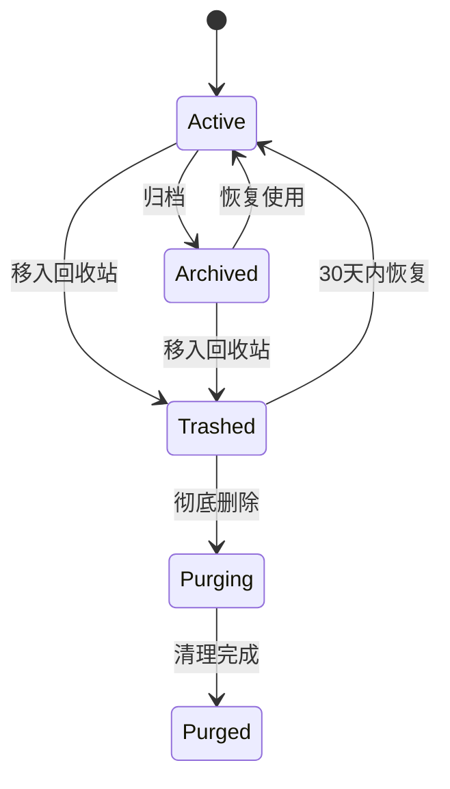

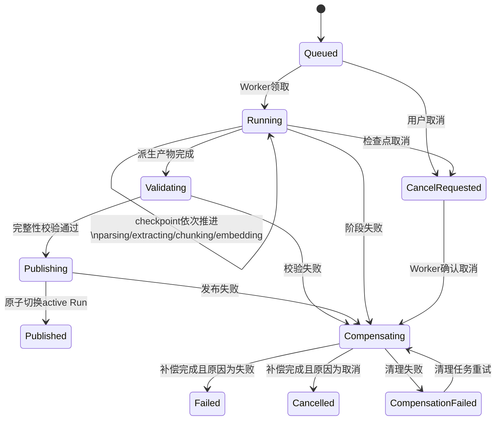

`parsing`、`extracting`、`chunking` 和 `embedding` 是 `status=running` 下的持久化 `checkpoint`，不是另一套顶层状态。数据库枚举、API DTO、Worker 判断和监控指标必须使用同一组小写状态名。

状态约束：

- `SourceDocument.state` 只表达资料生命周期；`IngestionRun.status/checkpoint` 表达后台流水线。
- Run 的解析产物、草稿、Parent/Child 和索引在 `Published` 前全部为暂存状态，普通检索、确认和学习流程不可见。
- 只有最终短事务可以切换 `SourceRevision.active_ingestion_run_id`；已有 Published Run 在新 Run 成功前继续服务。
- 失败或取消执行检查点补偿，不删除原始 Revision、旧 Published Run、正式知识点或历史学习记录。
- 相同流水线幂等摘要收敛到同一 Run；明确强制重建创建新的 `rebuild_request_id`。
- `content_hash` 用于用户边界内 Blob 去重，不能替代 Revision 或 Run 身份。
- 归档退出正式检索；进入回收站立即停用资料、Chunk、向量和来源关系；彻底删除后只保留最小墓碑。

### 9.2 知识点草稿确认状态机

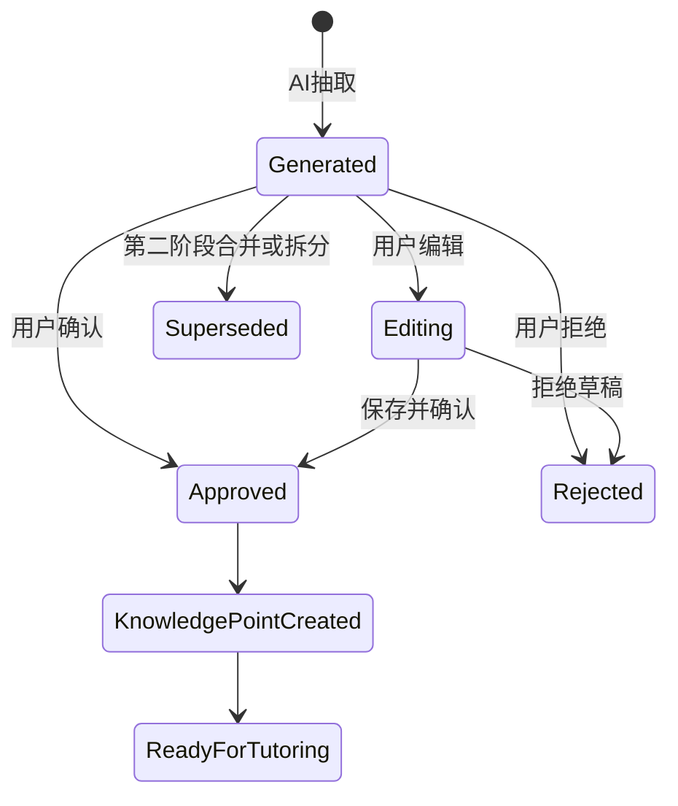

状态约束：

- `Generated` 不等于正式知识点。
- `Approved` 后才能创建正式 `KnowledgePoint`。
- 第二阶段的合并 / 拆分使用 `Superseded`，并由 `superseded_reason` 区分原因。
- 来源引用不能丢，用户编辑后也要保留原始 `source_refs`。
- 未确认草稿不能进入流式讲解、费曼考核、复习队列、知识星图和 AI 伴侣长期记忆。

### 9.3 费曼考核与 Rubric 判题状态机

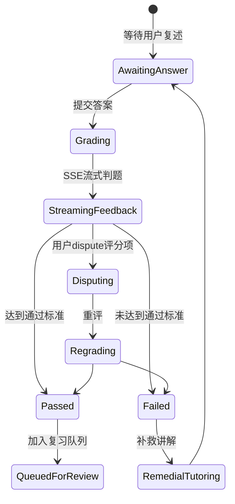

状态约束：

- Rubric 每一项都必须保存分数、证据、缺失点和 dispute 状态。
- dispute 不直接视为通过，只进入重评或确认路径。
- 判题结果中的薄弱点必须沉淀到 `weakness_tags`。

### 9.4 复习调度状态机

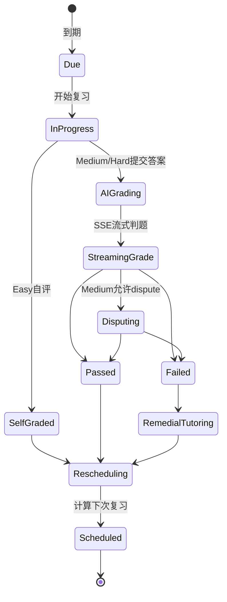

调度约束：

- BKT 更新掌握度，`p_mastery` 限制在 0.05-0.98。
- 下次间隔使用带 0.5-60 天边界的截断公式。
- Easy / Medium / Hard 只改变证据强度，不允许 UI 直接改写掌握度。
- dispute 成功追加补偿事件并重新归约 `MasteryState`。
- 复习熔断只延期高掌握度、低优先级任务，并保留原到期时间。
- Streak Freeze 只保护连续性，不增加掌握度。

### 9.5 Generation Session 状态机与 SSE 统一事件协议

模型生成与网络连接分离。先创建持久化 `GenerationSession` 和 Job，再由一个或多个 SSE 连接只读观察同一流程。

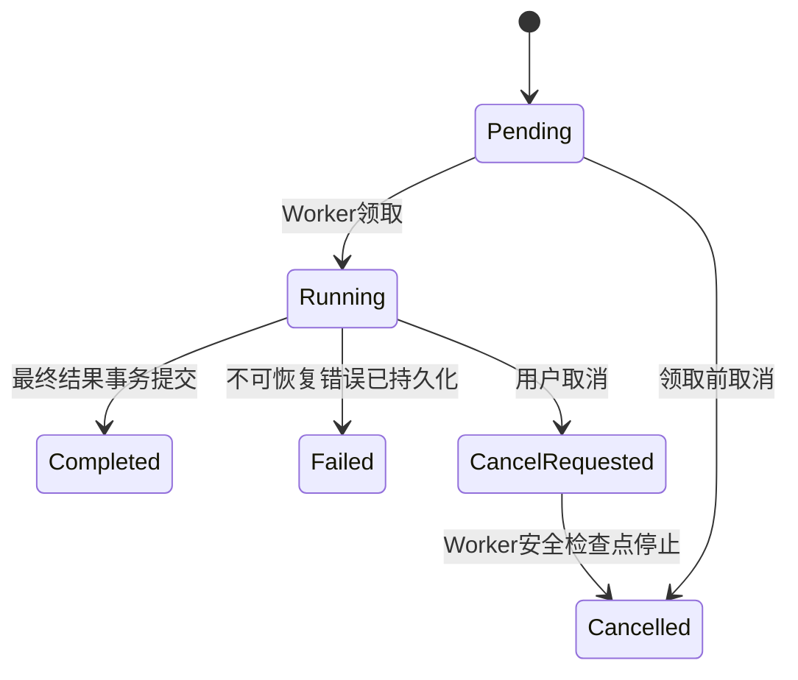

状态约束：

- 浏览器断线、刷新或关闭不改变 Session 状态，也不创建新 Provider 调用。
- `completed`、`failed` 和 `cancelled` 是终态；重复完成、失败或取消命令返回既有终态。
- Provider 迟到响应必须校验 Session 状态、调用幂等键和 Worker 租约；终态后结果直接丢弃。
- 最终结果和 `completed` 在同一短事务中持久化，提交后才能发布 `session_done`。
- SSE 连接不是业务状态，不能以连接开关推断 Session 成败。

讲解和判题共享同一事件信封：

```json
{
  "event_id": "evt_xxx",
  "session_id": "ses_xxx",
  "sequence": 12,
  "type": "token",
  "schema_version": "1",
  "payload": {},
  "created_at": "2026-07-12T10:00:00Z"
}
```

统一业务事件类型与 D08 保持一致：

- `session_started`
- `provider_selected`
- `content_delta`
- `fallback_started`
- `result_snapshot`
- `rubric_item`
- `weakness_detected`
- `progress`
- `requires_action`
- `session_done`
- `session_failed`
- `session_cancelled`

心跳使用 SSE comment 或独立 `heartbeat`，不占用业务 `event_id`。

协议约束：

- `sequence` 在单个 Session 内单调递增，`event_id` 全局唯一。
- 客户端使用 `Last-Event-ID` 请求恢复；前端刷新后也可通过 Session API 读取已持久化结果。
- `session_failed` 的 payload 必须区分 `retryable` 和 `fatal`，且不暴露第三方异常或敏感正文。
- `content_delta` 只是传输增量，不是最终事实源；完整讲解或评分先持久化，再发送 `session_done`。
- `session_done` 必须包含最终结果资源 ID，不能要求客户端从 Token 自行拼装业务事实。
- MVP 讲解使用 Token 流；Rubric 可逐项流式展示，但最终评分必须在一个 MySQL 事务中落库。

## 10. API 设计草案

后端 API 只暴露业务动作，不暴露底层工具细节。除登录和健康检查外，MVP API 都必须绑定当前 `user_id`。

### 10.0 Identity、Privacy 与 Session API

| 方法 | 路径 | 说明 |
| --- | --- | --- |
| `POST` | `/auth/login` | 本地用户登录 |
| `POST` | `/auth/logout` | 注销当前会话 |
| `GET` | `/auth/me` | 当前用户信息 |
| `GET` | `/privacy/settings` | 查看 Strict Local / Online Enhanced 授权 |
| `PATCH` | `/privacy/settings` | 按数据类别更新授权，不接受模糊总授权替代分类授权 |
| `GET` | `/privacy/consent-audits` | 查看外部 Provider 授权审计 |
| `GET` | `/sessions/{session_id}` | 恢复讲解或判题 Session 的持久化状态 |
| `GET` | `/sessions/{session_id}/events` | 按 `Last-Event-ID` 或 sequence 恢复 SSE 事件 |
| `GET` | `/jobs/{job_id}` | 查看后台任务进度和脱敏错误 |
| `POST` | `/jobs/{job_id}/retry` | 幂等重试失败任务 |

### 10.1 Topic API

| 方法 | 路径 | 说明 |
| --- | --- | --- |
| `POST` | `/topics` | 创建主题 |
| `GET` | `/topics` | 主题列表 |
| `GET` | `/topics/{topic_id}` | 主题详情 |
| `PATCH` | `/topics/{topic_id}` | 更新主题 |
| `POST` | `/topics/{topic_id}/archive` | 归档主题 |

### 10.2 Discovery API

| 方法 | 路径 | 说明 |
| --- | --- | --- |
| `POST` | `/topics/{topic_id}/search` | 按主题搜索候选资料 |
| `POST` | `/topics/{topic_id}/recommend-sources` | 根据主题生成 20 份候选资料 |
| `GET` | `/topics/{topic_id}/source-candidates` | 查看主题下候选资料 |
| `POST` | `/source-candidates/{candidate_id}/select` | 选择候选资料进入导入流程 |
| `POST` | `/source-candidates/bulk-select` | 批量选择候选资料，需要二次确认 |

### 10.3 Source API

| 方法 | 路径 | 说明 |
| --- | --- | --- |
| `POST` | `/sources/upload` | 上传 PDF 或其他支持的文件 |
| `POST` | `/sources/paste` | 粘贴文本生成来源资料 |
| `POST` | `/sources/url` | 提交网页 URL 并抽取正文 |
| `POST` | `/sources/scan-notes` | 扫描 `data/notes/` Markdown 文件 |
| `GET` | `/sources/{source_id}` | 查看来源资料状态 |
| `POST` | `/sources/{source_id}/reparse` | 重新解析来源资料 |
| `POST` | `/sources/{source_id}/ingest` | 解析、切片、生成知识点草稿和向量 |
| `POST` | `/sources/{source_id}/retry` | 重试失败任务 |

### 10.4 Knowledge Point Draft API

| 方法 | 路径 | 说明 |
| --- | --- | --- |
| `GET` | `/sources/{source_id}/knowledge-point-drafts` | 查看某个来源下的知识点草稿 |
| `PATCH` | `/knowledge-point-drafts/{draft_id}` | 编辑草稿核心字段 |
| `POST` | `/knowledge-point-drafts/{draft_id}/approve` | 确认草稿为正式知识点 |
| `POST` | `/knowledge-point-drafts/{draft_id}/reject` | 拒绝草稿 |
| `POST` | `/knowledge-point-drafts/merge` | 合并多个草稿，第二阶段预留 |
| `POST` | `/knowledge-point-drafts/{draft_id}/split` | 拆分草稿，第二阶段预留 |

### 10.5 Learning Discovery API

| 方法 | 路径 | 说明 |
| --- | --- | --- |
| `GET` | `/discovery/github-trending` | 按语言和周期拉取 GitHub Trending 仓库 |
| `POST` | `/discovery/github-repos/{repo_id}/import-readme` | 读取 README 并生成候选资料或来源资料 |
| `POST` | `/discovery/external-search` | 搜索外部论文 / 资讯 |
| `GET` | `/learning/recommendations` | 获取基于薄弱点和学习历史的学习推荐 |
| `POST` | `/learning/recommendations/{recommendation_id}/accept` | 接受推荐并加入候选或学习队列 |
| `POST` | `/learning/recommendations/{recommendation_id}/dismiss` | 忽略推荐 |

### 10.6 Tutoring API

| 方法 | 路径 | 说明 |
| --- | --- | --- |
| `POST` | `/knowledge-points/{point_id}/explain/stream` | SSE 流式讲解知识点 |
| `GET` | `/knowledge-points/{point_id}/explanation-plan` | 查看分层讲解计划 |
| `POST` | `/knowledge-points/{point_id}/feynman-assess` | 提交费曼复述并触发判题 |

### 10.7 Assessment API

| 方法 | 路径 | 说明 |
| --- | --- | --- |
| `POST` | `/knowledge-points/{point_id}/rubric` | 生成或刷新 Rubric |
| `POST` | `/assessments/{attempt_id}/grade/stream` | SSE 流式 AI 判题 |
| `POST` | `/rubric-score-items/{item_id}/dispute` | dispute 某条 Rubric 评分 |
| `POST` | `/assessments/{attempt_id}/resolve-dispute` | 处理 dispute 后的重评或确认 |

### 10.8 Review API

| 方法 | 路径 | 说明 |
| --- | --- | --- |
| `GET` | `/reviews/today` | 获取今日复习队列 |
| `POST` | `/reviews/{review_item_id}/start` | 开始复习 |
| `POST` | `/reviews/{review_item_id}/submit` | 提交复习答案或自评 |
| `POST` | `/reviews/{review_item_id}/postpone` | 手动延期复习 |
| `POST` | `/reviews/apply-circuit-breaker` | 应用复习熔断，延期轻松题 |
| `GET` | `/reviews/streak` | 查看 streak 和 freeze 状态 |
| `GET` | `/reviews/reward-events` | 查看积分事件 |

### 10.9 Atlas API

| 方法 | 路径 | 说明 |
| --- | --- | --- |
| `GET` | `/atlas/graph` | 获取 Atlas v2 图谱数据 |
| `GET` | `/atlas/nodes/{point_id}` | 获取节点详情 |
| `POST` | `/atlas/search` | 语义检索并高亮节点 |

### 10.10 AI Companion API

| 方法 | 路径 | 说明 |
| --- | --- | --- |
| `GET` | `/agent/tools` | 查看 AI 伴侣可用工具 |
| `POST` | `/agent/messages` | 发送 AI 伴侣消息，支持 ReAct 工具调用 |
| `GET` | `/agent/memories` | 查看跨会话记忆 |
| `PATCH` | `/agent/memories/{memory_id}` | 编辑记忆 |
| `DELETE` | `/agent/memories/{memory_id}` | 删除记忆 |

### 10.11 Learner Profile API

| 方法 | 路径 | 说明 |
| --- | --- | --- |
| `GET` | `/learner-profile` | 查看认知画像 |
| `PATCH` | `/learner-profile` | 编辑认知画像 |
| `GET` | `/learner-profile/emotion-timeline` | 查看情绪时序 |
| `POST` | `/learner-profile/emotion-diff` | 对一次对话生成情绪变化 diff |
| `GET` | `/learner-profile/weakness-tags` | 查看薄弱点图谱 |

### 10.12 Conversation API

| 方法 | 路径 | 说明 |
| --- | --- | --- |
| `POST` | `/conversations` | 创建对话 |
| `GET` | `/topics/{topic_id}/conversations` | 主题下对话列表 |
| `POST` | `/conversations/{conversation_id}/messages` | 发送问题并生成回答 |
| `GET` | `/conversations/{conversation_id}` | 获取对话详情 |

### 10.13 Export API

| 方法 | 路径 | 说明 |
| --- | --- | --- |
| `POST` | `/conversations/{conversation_id}/export` | 导出 Markdown |
| `GET` | `/exports/{export_id}` | 获取导出记录 |

## 11. RAG 策略

### 11.1 检索范围

MVP 默认只在用户选择的当前 Topic 内检索，可跨该 Topic 下多个 PDF。召回前必须限定 `user_id + selected_topic_id + active_ingestion_run_id + source_state=active`，不能先跨库召回再做权限过滤。

后续可以增加：

- 当前主题 + 指定文档。
- 多主题联合检索。
- 全库检索。

### 11.2 检索链路

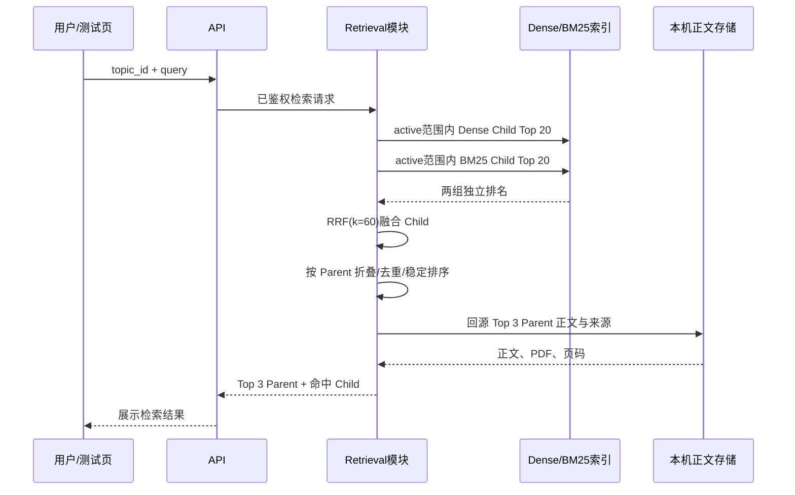

完整 Chat/RAG 在后续阶段消费该 Top 3 结果，再执行查询改写、上下文裁剪、LLM 回答生成、引用关联和对话持久化。

### 11.3 Prompt 约束

系统 prompt 应明确：

- 优先根据提供资料回答。
- 引用必须来自上下文 chunk。
- 不确定时直接说明资料不足。
- 不编造文献、页码、作者。
- 可以补充解释，但必须标记为非资料直接结论。

### 11.4 引用格式

回答中建议使用如下引用格式：

```markdown
该方法适合个人知识库，因为它可以按主题过滤检索范围，降低跨主题噪声。[资料A, p.12]
```

citation metadata 保存为结构化数据：

```json
{
  "chunk_id": "chunk_001",
  "source_document_id": "source_001",
  "title": "Example Paper",
  "page_start": 12,
  "page_end": 13,
  "source_url": "https://example.com/paper.pdf"
}
```

## 12. 文档导出设计

后续导出能力的第一种格式为 Markdown，不属于 MVP 主线。

### 12.1 默认导出结构

```markdown
---
title: 主题名称
created_at: 2026-07-12
sources:
  - title: 资料标题
    url: https://example.com/paper.pdf
    pages: 12
---

# 主题名称

## 资料清单

- 资料 A，作者，年份，来源链接

## 对话摘要

系统根据本次对话总结出的核心观点。

## 问答记录

### Q1: 用户问题

回答内容。

引用：
- 资料 A，p.12
- 资料 B，p.4

## 可继续研究的问题

- 问题 1
- 问题 2
```

### 12.2 导出模式

- 原样导出：不调用 LLM，完整保留对话。
- 摘要导出：调用 LLM 生成摘要、主题结构和后续问题。
- 研究笔记导出：把问答整理为更像文章的结构，后置实现。

### 12.3 导出原则

- 导出文件必须可被普通 Markdown 编辑器直接打开。
- 引用链接必须可追溯到原文档。
- 不把 API key、内部 prompt、调试日志写入导出文件。

## 13. 技术选型

### 13.1 后端

- Python 3.12。
- FastAPI：API 与 SSE 层。
- Pydantic：数据校验和领域 DTO。
- SQLAlchemy：MySQL 持久化与事务边界。
- Alembic：数据库迁移。
- httpx：用户授权的网页抓取和后续外部 API。
- PyMuPDF / PyMuPDF4LLM：PDF 到 Markdown / 文本。
- tiktoken 或同类 tokenizer：估算 chunk token。
- Milvus：Dense 向量和 Sparse/BM25 检索索引。
- 用户配置的 OpenAI-compatible LLM Provider：知识点抽取、讲解、Rubric 和判题。
- 远程 Ollama HTTPS Gateway：默认 Embedding Provider，锁定模型 digest 和向量维度。
- 自定义 Provider Adapter：统一 LLM、Embedding、Assessment 和 fallback 契约。
- API 与 Worker 使用同一镜像、不同启动命令；MVP 通过 MySQL 任务表协作，不引入 Redis / Celery。

### 13.2 前端

推荐：React + Vite。

理由：

- 适合做候选资料选择、任务状态展示、对话界面、引用展开。
- 后续可复用 API 层迁移到桌面壳。
- 与后端职责边界清晰。

如果目标是最快跑通原型，可以临时使用 Streamlit，但不建议作为长期架构。

### 13.3 数据库与运行方式

结构化业务数据库：MySQL。

原因：

- 用户身份、判题、薄弱点、学习事件、掌握度和复习任务需要明确事务边界。
- 避免 MySQL 保存用户信息、SQLite 保存学习数据造成跨库一致性和备份问题。
- Docker Compose 可统一管理数据库版本、健康检查和持久化卷。
- 后续扩展多用户时无需迁移核心业务数据库。

向量库：Milvus。

- 通过 `VectorStore` 抽象访问，领域模块不得直接调用 Milvus SDK。
- Milvus 只保存向量及 MySQL 记录 ID；删除、重建和恢复以 MySQL 为准。

Docker Compose 默认服务：

- `frontend`：React Web。
- `api`：FastAPI 请求、认证、查询和 SSE。
- `worker`：解析、知识点抽取、向量化等长任务。
- `mysql`：全部结构化业务数据。
- `milvus` 及其必要依赖：本机检索索引。

远程 Ollama 不属于本机 Compose；它部署在远程 GPU 节点并位于 HTTPS API Key 网关之后。LLM 默认调用用户配置的官网或兼容中转站 API。

MVP 不引入 Redis、Celery、Kafka、Elasticsearch 或 Kubernetes。

本地挂载卷约定：

- `data/notes/`：后续 Markdown 扫描目录。
- `data/uploads/`：用户上传的 PDF / 文本原件。
- `data/raw/`：网页 HTML 等原始快照。
- `data/parsed/`：解析后的 Markdown / JSON。
- `data/exports/`：后续导出的 Markdown 文档。
- `data/milvus/`：Milvus 数据。
- `data/mysql/`：MySQL 数据卷；备份必须使用一致性数据库备份流程，不能只复制运行中的数据文件。
- `data/cache/`：可删除并可重建的临时缓存。

D12 当前延期：MVP 不实现正式备份流程。首次保存需要长期保留的真实数据、迁移电脑或跨版本升级前，必须重新开启备份与恢复设计。

### 13.4 Provider 抽象与隐私路由

必须抽象以下 Provider：

- `SearchProvider`：OpenAlex、Semantic Scholar、arXiv、Tavily 等，MVP 后置。
- `GitHubProvider`：GitHub Trending、仓库 metadata、README 抽取，MVP 后置。
- `PdfParser`：PyMuPDF、未来 OCR parser。
- `WebExtractor`：trafilatura、readability-lxml、未来 Playwright。
- `EmbeddingProvider`：默认连接受认证 HTTPS 网关保护的远程 Ollama；失败时可将整条 Run 切换到用户授权的外部 API，并创建独立索引版本。
- `ChatProvider`：默认使用用户配置的模型官网或兼容中转站 API。
- `AssessmentProvider`：Rubric 生成、AI 判题、dispute 重评，默认使用用户配置的外部 LLM API。
- `ProfileProvider`：认知画像和情绪 diff，MVP 后置且不得继承宽泛云授权。
- `AgentToolProvider`：AI 伴侣工具注册与执行，MVP 后置。
- `VectorStore`：默认 Milvus，未来可替换其他实现。

业务模块不能直接选择云或本地实现。统一的隐私路由先检查 `UserPrivacySettings` 和具体数据类别，再选择 Provider，并写入 `ProviderConsentAudit`。

本机数据优先模式的默认行为：

- MySQL、Milvus、原始资料、解析产物、学习记录和 Provider 凭据密文只保存在用户本机。
- 依赖 LLM 或 Embedding 的任务在发送最小必要文本前检查长期授权和任务级覆盖；未授权时明确失败，不隐式寻找本地模型。
- 外部搜索和 GitHub API 默认关闭；用户主动提交 URL 只授权该次网页抓取，不自动授权正文进入 LLM 或 Embedding。
- LLM 默认使用用户配置的官网或兼容中转站 API；Embedding 默认使用受认证 HTTPS 网关保护的远程 Ollama。
- 学习历史摘要、认知画像和情绪内容不继承普通知识内容授权。

### 13.5 配置分层与 `.env` 约定

根目录 `.env` 是本机部署参数入口，但不是所有运行数据的存储位置。

| 分类 | 存储位置 | 示例 |
| --- | --- | --- |
| 部署参数 | 根目录 `.env` | localhost 端口、MySQL/Milvus 连接、目录、日志级别、超时、任务租约、资源上限 |
| 算法初始默认值 | `.env` → 启动 Settings | 父子切片范围、Dense/BM25 候选数、RRF k、Embedding 批量、SSE 心跳 |
| 版本化运行快照 | MySQL | Run 的 chunk/retrieval 参数、Session 超时参数、BKT/遗忘模型版本 |
| 用户偏好与授权 | MySQL | 时区、Provider 选择、长期授权、任务级覆盖 |
| 用户 Provider 凭据 | MySQL 加密字段 | `base_url`、model、API Key 密文；接口只返回掩码 |
| 启动机密 | Docker Secret 优先，开发时可用 `.env` | 主加密密钥、首个管理员初始化密码 |

工程约束：

- `.env` 必须加入 `.gitignore`；仓库只提交无真实密钥的 `.env.example`。
- 后端只有 `backend/app/config.py` 的 Settings 层可以读取环境变量；领域模块和 Adapter 不得散落调用 `os.getenv()`。
- Settings 使用强类型、范围校验和启动期失败；日志只能输出脱敏配置摘要。
- Compose 通过 `env_file` 和显式变量映射让每个容器只获得必要配置，禁止把主密钥或数据库密码注入前端。
- 前端只允许 `VITE_API_BASE_URL` 等公开构建变量；任何 Key、密码和主密钥不得使用 `VITE_` 前缀。
- 修改 `.env` 只影响之后创建的任务。影响解释性的参数在 Run、Session 或模型配置创建时固化，不能追溯改变历史行为。
- 新增配置时必须同步更新 Settings、`.env.example`、范围校验和配置说明，禁止只添加隐式代码默认值。

建议 `.env.example` 至少按以下前缀分组：

- `APP_*`：环境、日志、默认时区和公开地址。
- `MYSQL_*`、`MILVUS_*`：本机存储连接。
- `STORAGE_*`：上传、解析、暂存、缓存目录和磁盘阈值。
- `JOB_*`：租约、续租、重试和单 Run 并发。
- `SOURCE_*`：文件大小、页数、字符数和 Child 数上限。
- `CHUNK_*`、`RETRIEVAL_*`：父子切片、候选池、RRF 和 Top N。
- `EMBEDDING_*`：远程网关默认地址、批量、并发、超时和锁定模型标识；真实 API Key 使用 Secret 或用户加密配置。
- `LLM_*`：系统级超时和重试上限；用户 `base_url/model/key` 不放共享 `.env`。
- `SSE_*`、`SESSION_*`：心跳、聚合、重放和会话时限。
- `BKT_*`、`RETENTION_*`：仅用于创建版本化模型配置的初始默认值。

## 14. 目录结构建议

建议结构如下：

```text
backend/
  app/
    main.py
    worker.py
    config.py                # 唯一环境变量读取入口
    domains/
      identity/
      privacy/
      topic/
      ingestion/
      document_processing/
      chunking/
      knowledge_extraction/
      knowledge_review/
      tutoring/
      assessment/
      review_scheduler/
      learning_events/
      discovery/             # MVP 后置
      rag/                   # MVP 后置
      atlas/                 # MVP 后置
      learner_profile/       # MVP 后置
      ai_companion/          # MVP 后置
    adapters/
      web_extractors/
      pdf_parsers/
      vector_store/
      llm_providers/
      embedding_providers/
      search_providers/      # MVP 后置
    infrastructure/
      database/
      file_storage/
      jobs/
      sse/
      auth/
frontend/
  src/
    pages/
    components/
    features/
      auth/
      sources/
      knowledge-review/
      tutoring/
      assessment/
      review/
data/
  notes/
  uploads/
  raw/
  parsed/
  exports/
  mysql/
  milvus/
  cache/
docker-compose.yml
.env.example
docs/
  personal-knowledge-base.md
```

架构重点不是文件数量，而是防止职责泄漏：

- `domains` 表达业务流程和纯逻辑。
- `adapters` 包装外部 API、PDF 库、向量库、LLM。
- `infrastructure` 处理数据库、文件、任务队列。
- 前端只处理交互状态，不承载 RAG 业务逻辑。

## 15. 安全、合规与隐私

必须处理的风险：

- 本地优先边界：MySQL、Milvus、文件存储、解析产物和用户配置保存在用户本机；LLM 与 Embedding 计算位于本机之外，必须按外部数据处理执行授权和最小化。
- `network_fetch_enabled` 只允许用户主动提交的 URL 抓取，不自动授予外部模型节点处理正文的权限。
- Provider 凭据配置与内容授权分离。用户可开启长期外部模型授权并按单次任务覆盖；单次禁止优先，依赖模型的任务在禁止外部调用时明确不可执行。
- 实际外部 LLM 调用以及远程 Ollama Embedding → 外部 Embedding API 的切换不在学习前端展示或逐次弹窗，但每次外部请求都必须保存授权快照、执行数据最小化并形成脱敏审计。
- Embedding 默认由远程 Ollama 执行；失败时只能对整条 Run 使用外部 API 全量重建独立索引版本，禁止跨 Provider 混写。认知画像和情绪内容不得继承宽泛外部授权，情绪内容默认禁止发送。
- 每次外部 API 调用记录用户、任务、规范化目标主机、Provider、模型、数据类别、字符数、处理目的、授权来源、耗时和状态，默认保留 180 天，但不保存完整 Prompt、敏感正文、请求头或 API Key。
- 用户自定义 `base_url` 只允许 HTTPS 公网目标，并对解析地址、连接地址和重定向执行 SSRF 与 DNS rebinding 防护；兼容中转站不得伪装成官方 Provider。
- 只下载开放访问资料或用户明确提供的资料，不自动绕过登录、验证码和付费墙。
- 用户 API Key 使用服务端主密钥认证加密后按 `user_id` 存入数据库，主密钥通过 Docker Secret 或本地环境变量注入；密钥明文不得写入镜像、数据库、日志、审计或导出文档。
- PDF 和网页作为不可信输入处理；限制大小、类型、重定向和解析资源，不执行嵌入内容。
- URL 只允许 `http` / `https`，解析每次重定向后的目标并阻止本机、内网、链路本地和云 metadata 地址，防止 SSRF 与 DNS rebinding。
- 日志按 `user_id`、`job_id`、`session_id` 关联，但不得输出完整资料、用户复述、令牌和密钥。
- 用户必须能够导出和删除自己的结构化数据、文件与向量；删除以 MySQL 事务记录为准并异步清理可重建产物。

建议限制：

- 单个文本型 PDF 最大 20MB、200 页、解析后 100 万有效字符；任一超限即整体拒绝，不截断处理。
- 单个 `IngestionRun` 最多 1,500 个可索引 `ChildChunk`；远程 Embedding 每批最多 32 个 Child、最多 2 个在途请求。
- Windows + WSL2 的 16GB 本机将 Docker 内存控制在约 10GB，知识库业务磁盘预算为 20GB；80% 告警，90% 停止新导入。
- 同时只执行 1 个 `IngestionRun`，其他任务持久化排队；单 Run 最长执行 60 分钟。
- SSE 目标 3 秒内产生首个有效增量，15 秒无首段超时，流式输出后使用 30 秒空闲超时。
- 网页下载超时默认 60 秒，并限制响应体和重定向次数。
- 只接受允许的 MIME 类型，并校验文件签名而非只相信扩展名。
- Docker Web/API 端口只绑定 `127.0.0.1`；如未来开放局域网或公网访问，必须重新评估 HTTPS、CORS、会话和暴力破解防护。
- 密码只保存强哈希；会话 Cookie 使用 `HttpOnly`、`SameSite=Strict`，启用 HTTPS 时同时要求 `Secure`。

## 16. 质量评估

MVP 评估优先验证学习闭环；父子切片与 Top 3 检索作为导入索引的基础质量门槛，但不要求完整 RAG 回答指标。

MVP 指标：

- 导入成功率：PDF、粘贴文本和静态网页生成统一 `ParsedDocument` 的比例。
- 任务可靠性：幂等命中率、失败重试成功率、重复业务记录数量。
- 知识点抽取质量：草稿通过率、编辑率、拒绝率、来源引用完整率。
- Rubric 一致性：固定答案重复判题差异、dispute 推翻率和严重事实错误漏判率。
- SSE 可恢复性：断线后事件顺序、最终结果和持久化状态是否一致。
- BKT 可解释性：每次掌握度变化是否能关联到 `LearningEvent` 和参数版本。
- 调度正确性：0.5-60 天边界、失败短周期、dispute 补偿和下一次到期时间是否正确。
- 检索质量：固定查询集的 Top 3 来源命中率、MRR、无结果率，以及同 Parent Child 不重复占位和跨用户/旧 Run 零泄漏。
- 隐私合规：未经用户授权发送到外部 LLM、远程 Ollama 或外部 Embedding API 的请求数量必须为 0。

MVP 固定验收集：

- 1 个文本型 PDF、1 段粘贴文本和 1 个静态网页。
- 至少 5 个经用户确认的知识点及其来源引用。
- 1 个通过答案、1 个失败答案和 1 个可推翻的争议案例。
- 1 次断线恢复、1 次任务失败重试和 1 次真实到期复习。
- 1 组覆盖单 PDF、多 PDF、同义表达、精确术语和重复段落的检索查询，验证 Dense/BM25、RRF 与 Top 3 Parent 去重。
- 修改解析、父子切片、检索、抽取、Rubric、BKT 或 SSE 协议后必须运行对应回归。

后续阶段再增加引用准确率、回答忠实度、推荐接受率、画像有效性和导出完整性。

## 17. 里程碑规划

### M0：冻结架构与契约

产物：MVP 范围、隐私授权矩阵、数据归属、任务协议、SSE 信封、Rubric 和 BKT 默认规则。

验收：本文档中的默认路线统一为本机 Docker Compose + MySQL + Milvus、外部 LLM API和远程 Ollama Embedding，不存在 SQLite、裸露 Ollama 端口或资料发现进入 MVP 的冲突描述。

### M1：基础设施与身份边界

产物：本机 Docker Compose、React、FastAPI API / Worker 双进程、MySQL、Milvus、远程 Ollama Embedding Provider、用户登录、Alembic、任务表和 SSE 基础设施。

验收：本机服务通过健康检查且只绑定 localhost；用户可以登录；远程 Ollama 只能通过带 API Key 的 HTTPS 网关访问；API 与 Worker 能通过 MySQL 租约完成一个幂等测试任务。

### M2：统一资料导入与检索索引

产物：文本型 PDF 上传、粘贴文本、静态网页 URL、原始文件卷、`SourceDocument`、`ParsedDocument`、Parent/Child Chunk、Dense/BM25 索引、RRF Top 3 检索、失败重试和任务进度。

验收：三种输入生成统一解析结果；每份逻辑 PDF 保持稳定 `source_document_id`；重复提交不会重复创建业务数据；URL 通过 SSRF 校验；失败任务可安全重试；固定查询可在 Topic 内返回最多 3 个去重 Parent 及其来源和命中 Child。

### M3：知识点草稿与确认

产物：外部 LLM 抽取 `KnowledgePointDraft`、颗粒度控制、来源引用、轻量确认工作台、`review_policy` 和正式 `KnowledgePoint` 创建。

验收：至少生成并确认 5 个知识点；未通过草稿不能进入讲解、判题和复习；抽取失败可降级到分段重试或用户手动创建。

### M4：SSE 讲解、费曼与 Rubric

产物：持久化学习 Session、SSE 分层讲解、费曼复述、0-4 Rubric 逐项判题、`weakness_tags`、评分版本和 dispute。

验收：Session 可断线恢复；存在一次通过、一次失败和一次 dispute；重评不覆盖原评分，推翻原判时追加补偿 `LearningEvent`。

### M5：BKT 与真实复习闭环

产物：`LearningEvent`、`MasteryState`、`MasteryModelConfig`、`ReviewTask`、Easy / Medium / Hard、到期复习、动态间隔和复习熔断。

验收：一个知识点从首次费曼通过进入队列，完成一次真实到期复习，更新掌握度并计算下一次复习时间；所有变化可由事件和参数版本解释。

### M6：MVP 固定数据集验收

产物：固定 PDF、粘贴文本和静态网页测试数据，端到端测试、隐私外联检查、失败恢复验证和基础性能报告。

验收：完整闭环在干净环境中稳定复现；Strict Local 无未授权外联；关键事务、任务重试和 SSE 恢复满足验收标准。

### M7：资料发现与完整 RAG

产物：`data/notes/` 扫描、主题推荐 20 份候选资料、GitHub Trending、外部论文 / 资讯搜索、基于既有 Top 3 检索服务的 RAG 引用问答和 Markdown 导出。

验收：推荐只生成 `SourceCandidate`，用户选择后才转为 `SourceDocument`；RAG 回答引用可追溯，不改变核心学习状态。

### M8：探索、伴侣与画像

产物：Atlas v2、AI 伴侣工具权限、跨会话记忆、认知画像、可选情绪时序、知识点合并 / 拆分和质量优化。

验收：有副作用工具必须确认；画像可查看、编辑、删除；情绪时序默认关闭且不作为医学判断；所有新能力复用既有学习事实源。

## 18. 风险与取舍

### 18.1 PDF 搜索不稳定

风险：并非所有资料都有直接 PDF URL。

策略：

- 优先 API 数据源。
- 候选资料中明确展示“可直接下载 / 仅有详情页 / 需要用户手动上传”。
- 支持用户本地上传 PDF，作为资料发现失败时的补充路径。

### 18.2 PDF 解析质量不稳定

风险：表格、双栏论文、扫描版 PDF 解析效果差。

策略：

- MVP 先支持文本型 PDF。
- 扫描版标记 `requires_ocr`。
- 后续引入 OCR 和版面模型。

### 18.3 RAG 回答幻觉

风险：模型生成未被资料支撑的内容。

策略：

- prompt 明确要求证据不足时拒答。
- 回答强制引用 chunk。
- 对无引用回答做前端提醒。
- 建立小型评测集。

### 18.4 模块复杂度扩散

风险：Discovery、下载、解析、向量化、问答、复习、画像和 AI 伴侣混在一个服务中，后期难维护。

策略：

- 从一开始按领域模块拆分。
- 外部 SDK 只出现在 adapter 层。
- API 层不写业务流程细节。
- 画像、复习、判题、推荐、RAG、AI 伴侣必须通过清晰接口协作。

### 18.5 GitHub Trending 与外部资讯质量不稳定

风险：Trending 仓库和资讯热度不等于学习价值，README 也可能营销化或过时。

策略：

- 推荐结果只作为 `SourceCandidate`，用户确认后才入库。
- 展示推荐理由、来源、star、更新时间、语言和 README 摘要。
- 智能推荐需要结合用户目标、薄弱点和历史，而不是单纯追热点。

### 18.6 Rubric 判题误判

风险：LLM 评分可能过严、过松或误解用户表达。

策略：

- Medium 难度允许 dispute。
- 每条评分必须给出证据和缺失点。
- dispute 结果进入质量评估，长期优化 Rubric 生成。
- Hard 强判只用于核心知识点。

### 18.7 BKT 公式边界

风险：未经截断的对数间隔公式在低掌握度时会产生非正间隔，参数变化也可能导致历史状态无法解释。

策略：

- 统一使用 `clamp(7 × log(p_mastery/0.4) / log(2), 0.5, 60)`。
- `p_mastery` 限制在 0.05-0.98，低掌握度进入短周期复习或补救讲解。
- BKT 参数版本化，掌握度变化保留 `LearningEvent` 和模型版本。
- 积分、Streak 不反向修改真实掌握度。

### 18.8 复习积压压垮用户

风险：复习队列越积越多，导致用户放弃系统。

策略：

- 引入复习熔断。
- 优先保留低掌握度、高重要度、Hard 知识点。
- 自动延期 Easy 和高掌握度知识点。
- Streak Freeze 保护偶发中断。

### 18.9 AI 伴侣副作用过大

风险：AI 伴侣如果能直接修改复习计划、画像或知识库，可能造成不可控状态变化。

策略：

- ReAct 工具调用必须经过业务 API。
- 有副作用的工具必须用户确认。
- 工具调用写入 `AgentToolCall`。
- AI 伴侣不能绕过审阅流程直接创建正式知识点。

### 18.10 认知画像与情绪推断敏感

风险：认知画像和情绪时序涉及敏感个人数据，错误推断可能影响用户体验。

策略：

- 默认本地存储。
- 用户可查看、编辑、删除画像。
- 情绪推断只作为学习体验信号，不作为医学诊断。
- 云模型增强模式下必须明确提示可能上传的上下文范围。

## 19. 已冻结的实施决策

以下决策是实现基线，不再作为开工前待确认项：

1. MVP 实现导入、解析、父子切片、Dense/BM25 + RRF Top 3 检索、知识点确认、SSE 讲解、费曼、Rubric、薄弱点、一次真实复习和掌握度更新；完整 RAG 回答生成后置。
2. 本机保存全部业务数据并仅监听 localhost；用户主动 URL 抓取与外部模型处理是两类独立权限。
3. 第一版使用本地 `User`、密码登录和 `user_id` 数据归属，不实现复杂角色与多租户权限。
4. 运行方式为 Docker Compose。
5. MySQL 保存全部结构化业务数据；禁止再以 SQLite 分担用户或学习数据。
6. Milvus 保存向量，本地卷保存原始资料和派生产物。
7. LLM 默认使用用户配置的官网或兼容中转站 API；Embedding 默认使用受认证 HTTPS 网关保护的远程 Ollama，所有外部处理按数据类别授权。
8. FastAPI API 与 Worker 分离；MVP 使用 MySQL 任务表和租约，不引入 Redis / Celery。
9. 知识点确认工作台采用轻量版；合并、拆分和图谱编辑后置。
10. SSE、Rubric、BKT、dispute 和 `LearningEvent` 使用本文定义的版本化协议。
11. 主题推荐、GitHub Trending、外部搜索、完整 RAG 回答/UI、Atlas、AI 伴侣、认知画像和情绪时序不进入 MVP 主线；Topic 内 Top 3 检索服务属于 MVP。

默认技术基线：

- Python 3.12。
- FastAPI + React + Vite。
- 本机 Docker Compose + MySQL + Milvus，Web/API 端口只绑定 localhost。
- 用户配置的外部 LLM API；受 API Key 保护的远程 Ollama `qwen3-embedding:4b` HTTPS 网关；外部 Embedding API 仅作为整条 Run 的独立索引 fallback。
- PyMuPDF / PyMuPDF4LLM。
- `trafilatura`，`readability-lxml` 作为静态网页正文抽取备用。
- SQLAlchemy + Alembic。
- Provider / Adapter 隔离外部模型、搜索、解析器和向量库。

## 20. 参考资料源

项目资料发现阶段优先考虑以下开放或半开放资料源：

- OpenAlex Developers：https://developers.openalex.org/
- Semantic Scholar API：https://www.semanticscholar.org/product/api
- arXiv API：https://info.arxiv.org/help/api/index.html
- Crossref REST API：https://www.crossref.org/documentation/retrieve-metadata/rest-api/
- Unpaywall：https://unpaywall.org/products/api
- PyMuPDF RAG 文档：https://pymupdf.readthedocs.io/en/latest/rag.html
- Milvus Documentation：https://milvus.io/docs